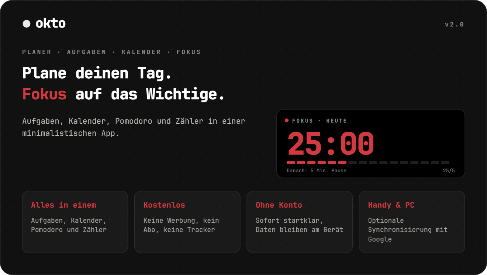
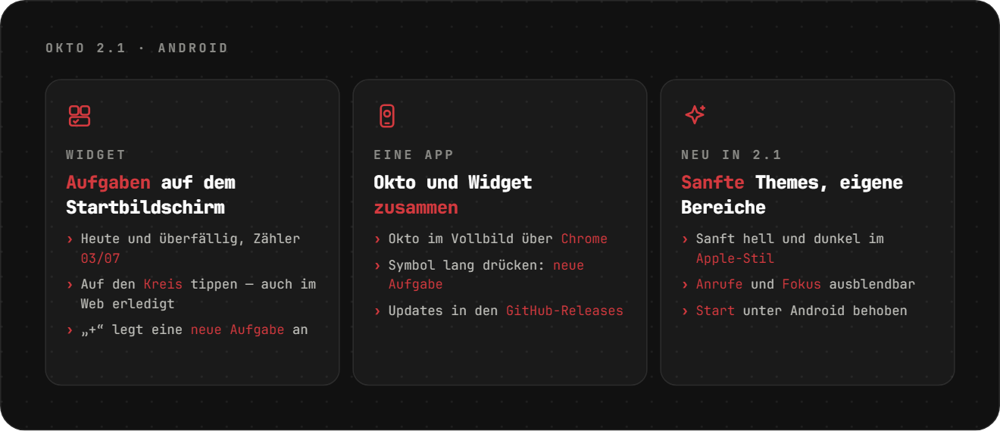
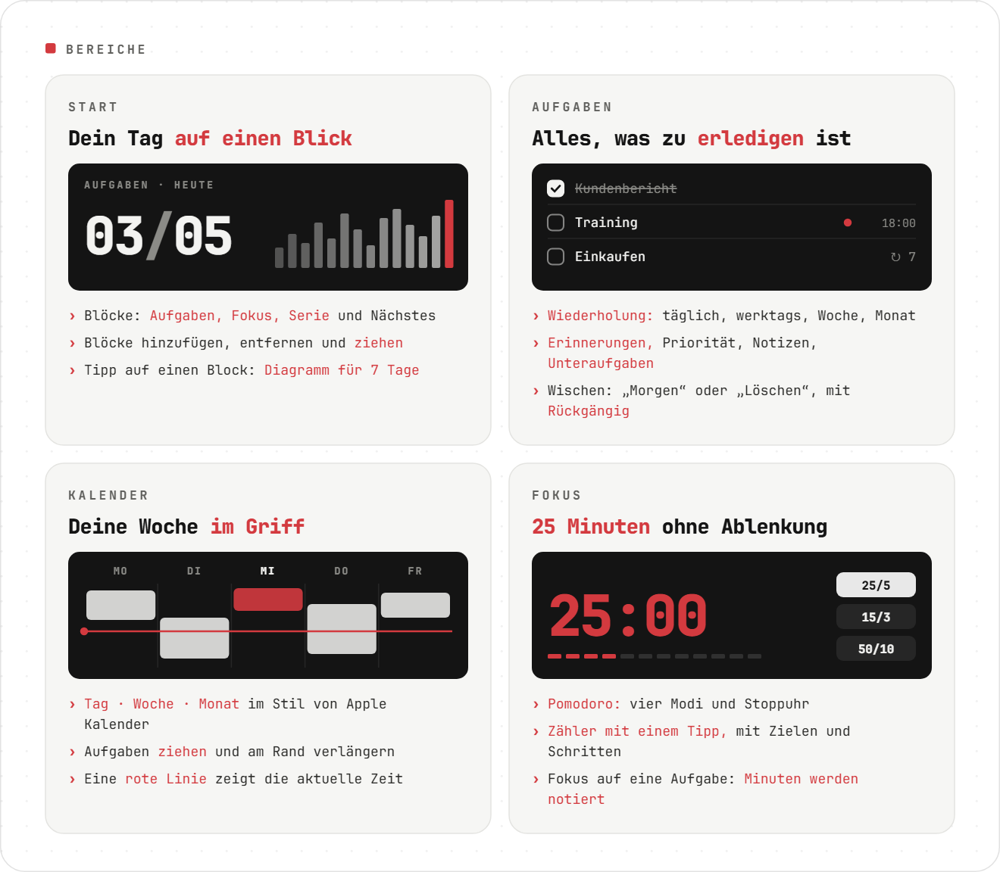
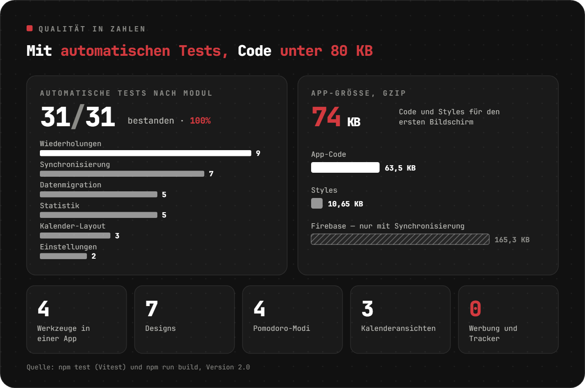
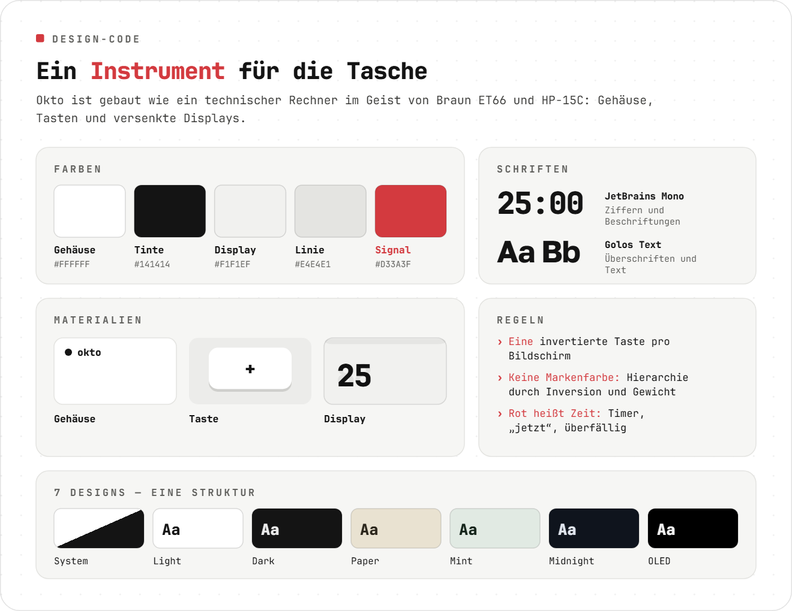
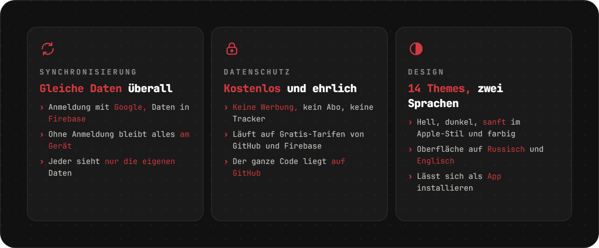
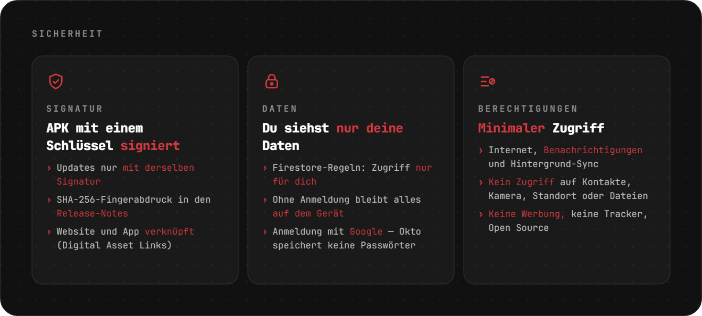

<div align="center">

[Русский](README.md) · [English](README.en.md) · [Español](README.es.md) · [Português](README.pt.md) · **Deutsch** · [Français](README.fr.md) · [Italiano](README.it.md) · [Türkçe](README.tr.md) · [Українська](README.uk.md) · [Polski](README.pl.md)

<br>

<picture><source srcset="assets/readme/hero-de.svg"></picture>

<a href="https://sailxx.github.io/Okto/"></a>&nbsp;&nbsp;<a href="https://github.com/sailxx/Okto/releases/latest/download/Okto.apk"></a>

**Okto läuft auf jedem Gerät** — iPhone und Android, Tablets, Windows, macOS und Linux. Ein Browser genügt, auf Handy und Computer lässt sich Okto als App installieren. Für Android gibt es zusätzlich eine App mit Aufgaben-Widget — auch im [Komi Store](https://github.com/komi-store/komi-store).

</div>

> [!NOTE]
> Die App-Oberfläche gibt es auf Russisch und Englisch.

<br>


<br>

<picture><source srcset="assets/readme/android-de.svg"></picture>

<br>

<picture><source srcset="assets/readme/sections-de.svg"></picture>

<details>
<summary>Mehr zu den Bereichen</summary>

### 🏠 Start

Produktivitätsblöcke: **Aufgaben** (erledigt von geplant), **Fokus** (Pomodoro-Minuten), **Serie** (Tage am Stück mit Aufgabe oder Fokus), **Als Nächstes** (die nächste Aufgabe) und **Zähler** für beliebige Tags. Blöcke über „Bearbeiten“ hinzufügen, entfernen und verschieben. Ein Tipp auf einen Block zeigt ein 7-Tage-Diagramm und die Summe über 30 Tage.

### ✅ Aufgaben

Filter: Heute (mit überfälligen), Demnächst, Alle, Ohne Datum, Erledigt — dazu eigene farbige **Listen**. Eine Aufgabe hat Datum, Uhrzeit und Dauer, **Wiederholung** (täglich, werktags, wöchentlich, monatlich, Intervall, Enddatum), **Erinnerung**, Priorität, Notiz und **Unteraufgaben**. **Fokus auf eine Aufgabe** startet Pomodoro und schreibt die Minuten zur Aufgabe. Am Handy nach links wischen für „Morgen“ oder „Löschen“; alles lässt sich rückgängig machen.

### 📅 Kalender

Im Stil von Apple Kalender: **Tag · Woche · Monat**, rote Linie für die aktuelle Zeit und eine Ganztägig-Zeile. Eine neue Aufgabe erscheint sofort im Kalender. Blöcke auf eine andere Zeit oder einen anderen Tag **ziehen** und am unteren Rand **verlängern** (15-Minuten-Schritte; am Handy nach langem Drücken). Bei wiederkehrenden Aufgaben fragt Okto: nur diese, alle künftigen oder die ganze Serie.

### 🎯 Fokus

Zähler mit einem Tipp und Pomodoro: Vorlagen-Tags mit Zielen, Schritte +1/+5/+10, Halten zum Zurücksetzen, vier Pomodoro-Modi, Stoppuhr und „Bildschirm anlassen“.

</details>

<br>

<picture><source srcset="assets/readme/quality-de.svg"></picture>

<br>

<picture><source srcset="assets/readme/design-de.svg"></picture>

<br>

<picture><source srcset="assets/readme/more-de.svg"></picture>

<details>
<summary>Synchronisierung einschalten</summary>

Standardmäßig speichert Okto alles im Browser des Geräts. Für dieselben Daten auf Handy und Computer ein kostenloses Firebase-Projekt verbinden (Spark-Tarif, keine Karte nötig):

1. Projekt auf [console.firebase.google.com](https://console.firebase.google.com/) anlegen.
2. **Authentication → Sign-in method** — **Google** aktivieren. Unter **Settings → Authorized domains** `sailxx.github.io` hinzufügen.
3. **Firestore Database** — Datenbank anlegen und [`firestore.rules`](firestore.rules) im Tab **Rules** einfügen.
4. **Project settings → Your apps → Web** — App registrieren und `apiKey`, `authDomain`, `projectId`, `appId` kopieren.
5. Im GitHub-Repo: **Settings → Secrets and variables → Actions** — die Secrets `VITE_FIREBASE_API_KEY`, `VITE_FIREBASE_AUTH_DOMAIN`, `VITE_FIREBASE_PROJECT_ID`, `VITE_FIREBASE_APP_ID` anlegen.
6. Deploy starten. In den Einstellungen von Okto erscheint „Mit Google anmelden“.

Diese Schlüssel sind nicht geheim: Den Zugriff schützen die Firestore-Regeln, jeder sieht nur seine eigenen Daten. Erinnerungen auf der Website kommen, solange der Tab offen ist.

</details>

<br>

<picture><source srcset="assets/readme/safe-de.svg"></picture>

<br>

## 🛠 Entwicklung

```bash
npm install
npm run dev      # http://localhost:5173
npm test         # Vitest: Wiederholungen, Statistik, Migration, Synchronisierung, Kalender
npm run check    # svelte-check
npm run build    # Build nach dist/
```

Für Synchronisierung lokal `.env.example` nach `.env.local` kopieren und die Schlüssel eintragen. GitHub Pages veröffentlicht automatisch bei jeder Änderung in `main`.

## 🗂 Versionen

**2.1** — Android-App mit Aufgaben-Widget für den Startbildschirm; sanfte helle und dunkle Themes im Apple-Stil; Anrufe und Fokus ausblendbar; Sprache in den Einstellungen; Start unter Android behoben.

**2.0** — Aufgaben mit Listen, Wiederholungen, Unteraufgaben und Erinnerungen; Kalender im Stil von Apple Kalender mit Drag & Drop; anpassbarer Start; Synchronisierung über Firebase; Fokus auf eine Aufgabe.

**1.0** — Pomodoro mit vier Modi, farbige Vorlagen-Tags, sieben Designs, Englisch, Browser-Benachrichtigungen.

## ⚖️ Lizenzen

Die Schrift [Inter](https://rsms.me/inter/) steht unter der SIL Open Font License 1.1. Die README-Bilder sind in [JetBrains Mono](https://github.com/JetBrains/JetBrainsMono) (OFL 1.1) + [Golos Text](https://github.com/googlefonts/golos-text) (OFL 1.1) gesetzt.

<div align="center">
<br>
<sub>Gemacht von [Vlad](https://t.me/arkhitkovv). Wenn dir Okto hilft, gib dem Repo einen ⭐</sub>
</div>
