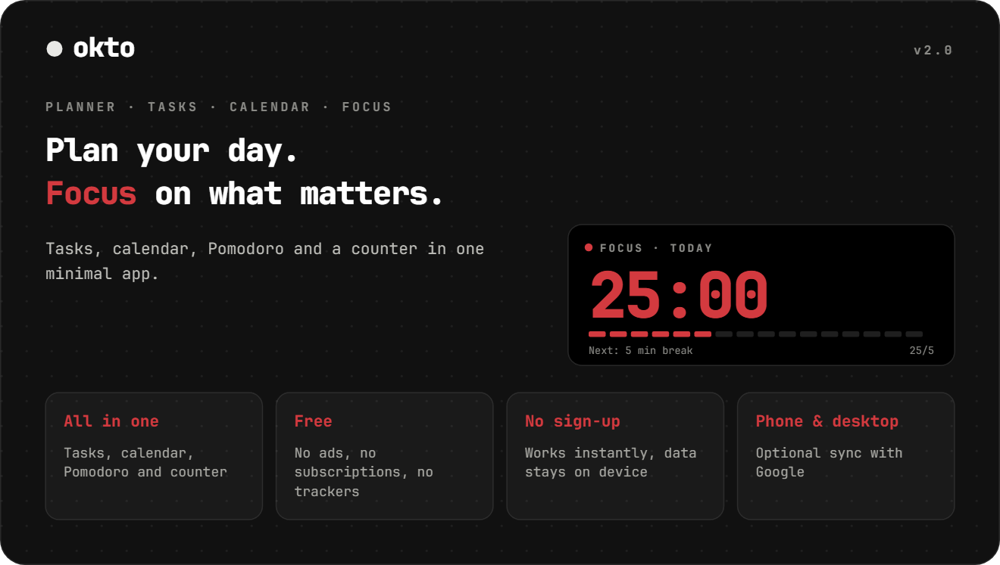
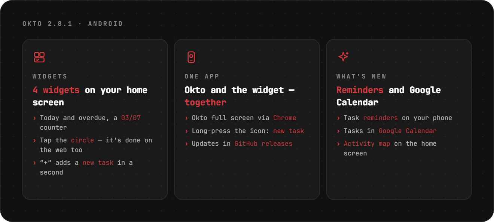
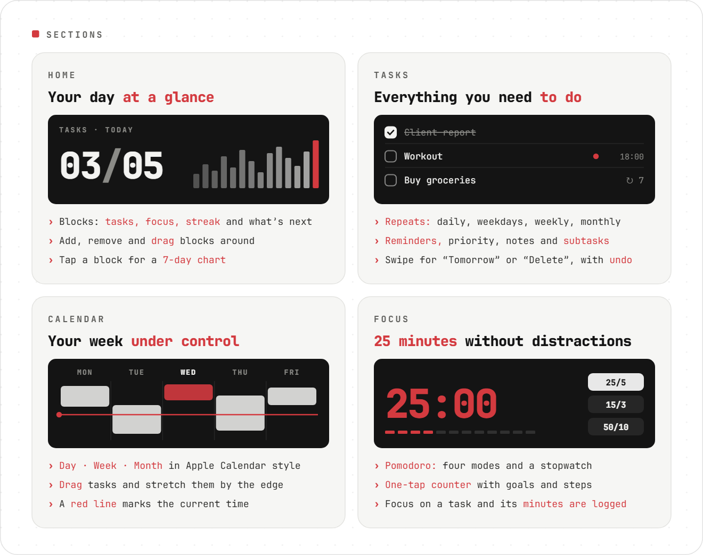
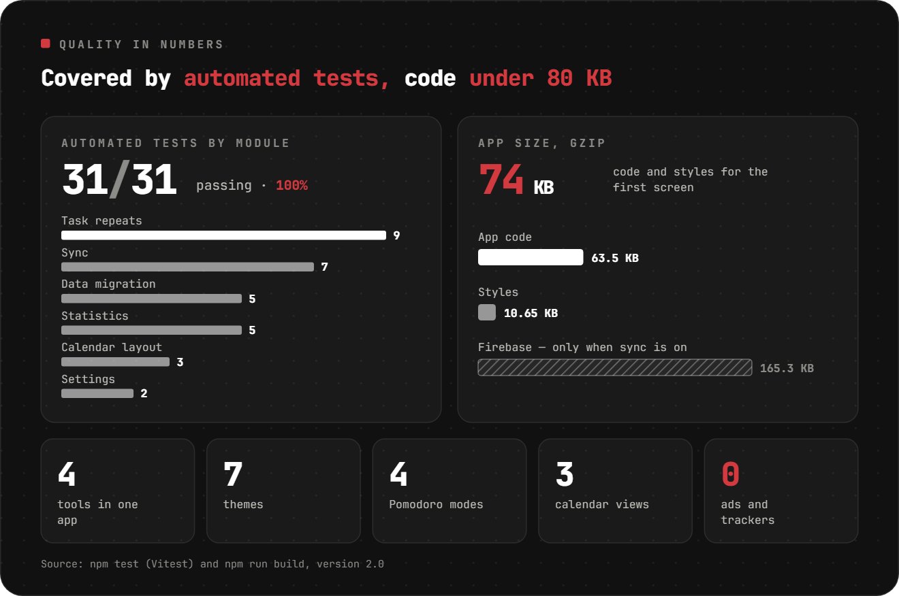
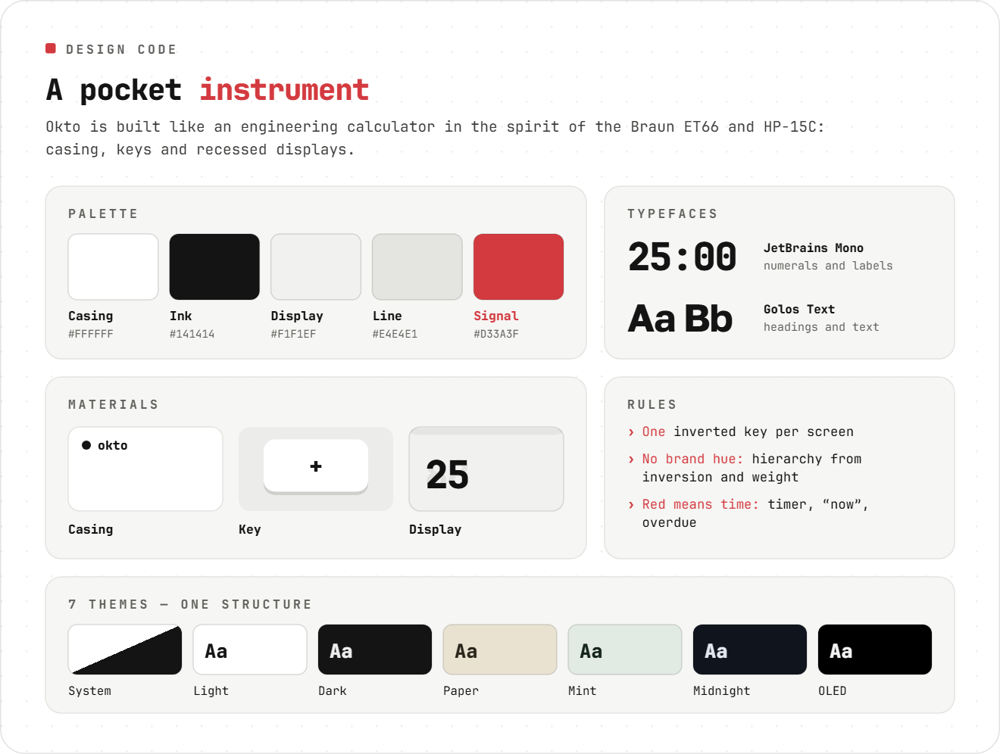
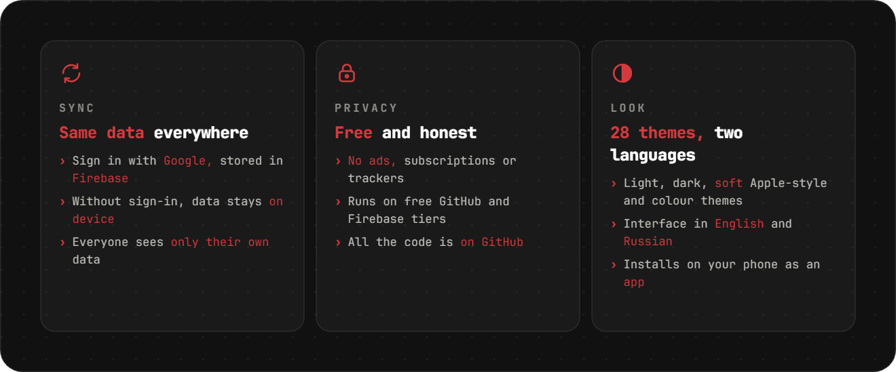
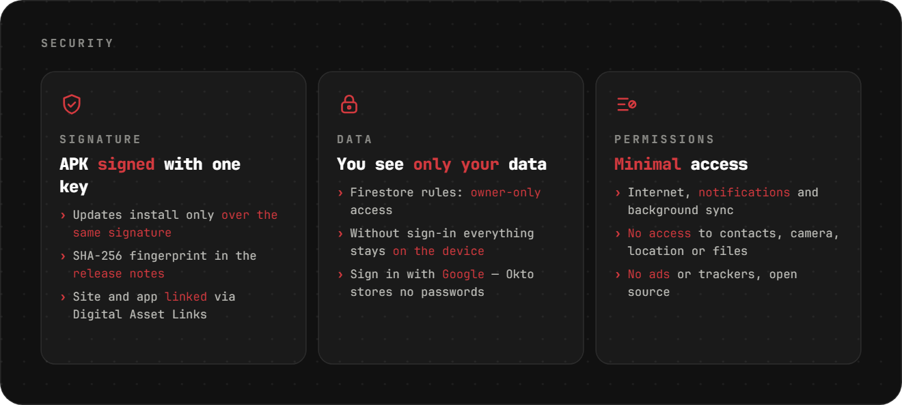

<div align="center">

[Русский](README.md) · **English** · [Español](README.es.md) · [Português](README.pt.md) · [Deutsch](README.de.md) · [Français](README.fr.md) · [Italiano](README.it.md) · [Türkçe](README.tr.md) · [Українська](README.uk.md) · [Polski](README.pl.md)

<br>

<picture><source srcset="assets/readme/hero-en.svg"></picture>

<a href="https://sailxx.github.io/Okto/"></a>&nbsp;&nbsp;<a href="https://github.com/sailxx/Okto/releases/latest/download/Okto.apk"></a>

**Okto works on any device** — iPhone and Android, tablets, Windows, macOS and Linux. All you need is a browser, and Okto installs as an app on your phone or computer. Android also gets a dedicated app with a task widget — you can find it in [Komi Store](https://github.com/komi-store/komi-store) too.

</div>

> [!NOTE]
> The app interface is available in Russian and English.

<br>


<br>

<picture><source srcset="assets/readme/android-en.svg"></picture>

<br>

<picture><source srcset="assets/readme/sections-en.svg"></picture>

<details>
<summary>More about the sections</summary>

### 🏠 Home

Productivity blocks: **Tasks** (done out of planned), **Focus** (Pomodoro minutes), **Streak** (days in a row with a task or focus), **Next** (the nearest task) and **counters** for any tag. Add, remove and drag blocks with the “Edit” button. Tap a block for a 7-day chart and a 30-day total.

### ✅ Tasks

Filters: Today (with overdue), Upcoming, All, No date, Completed — plus your own coloured **lists**. A task has a date, time and duration, a **repeat** (daily, weekdays, weekly, monthly, interval, end date), a **reminder**, priority, a note and **subtasks**. **Focus on a task** starts Pomodoro and logs the minutes to it. On a phone, swipe left for “Tomorrow” or “Delete”; every action can be undone.

### 📅 Calendar

Apple Calendar style: **Day · Week · Month**, a red current-time line and an all-day row. A new task shows up in the calendar right away. **Drag** blocks to another time or day and **stretch** them by the bottom edge (15-minute steps; on a phone after a long press). For repeating tasks Okto asks: this one, all future ones or the whole series.

### 🎯 Focus

A one-tap counter and Pomodoro: preset tags with goals, +1/+5/+10 steps, hold to reset, four Pomodoro modes, a stopwatch and “keep screen on”.

</details>

<br>

<picture><source srcset="assets/readme/quality-en.svg"></picture>

<br>

<picture><source srcset="assets/readme/design-en.svg"></picture>

<br>

<picture><source srcset="assets/readme/more-en.svg"></picture>

<details>
<summary>How to turn on sync</summary>

Out of the box Okto keeps everything in the browser on your device. To have the same data on phone and computer, connect a free Firebase project (Spark plan, no card needed):

1. Create a project at [console.firebase.google.com](https://console.firebase.google.com/).
2. **Authentication → Sign-in method** — enable **Google**. In **Settings → Authorized domains** add `sailxx.github.io`.
3. **Firestore Database** — create a database and paste [`firestore.rules`](firestore.rules) into the **Rules** tab.
4. **Project settings → Your apps → Web** — register the app and copy `apiKey`, `authDomain`, `projectId`, `appId`.
5. In the GitHub repo: **Settings → Secrets and variables → Actions** — add the secrets `VITE_FIREBASE_API_KEY`, `VITE_FIREBASE_AUTH_DOMAIN`, `VITE_FIREBASE_PROJECT_ID`, `VITE_FIREBASE_APP_ID`.
6. Run the deploy. “Sign in with Google” appears in Okto’s settings.

These keys are not secret — access is protected by Firestore rules, so everyone sees only their own data. Reminders on the website fire while the tab is open.

</details>

<br>

<picture><source srcset="assets/readme/safe-en.svg"></picture>

<br>

## 🛠 Development

```bash
npm install
npm run dev      # http://localhost:5173
npm test         # Vitest: repeats, stats, data migration, sync, calendar layout
npm run check    # svelte-check
npm run build    # build into dist/
```

For sync during local development, copy `.env.example` to `.env.local` and fill in the keys. GitHub Pages publishes automatically on every change to `main`.

## 🗂 Version history

**2.2–2.8** — choose the app icon; photos and files in tasks, offline launch; collapsible month in the calendar; task reminders on Android; tasks in Google Calendar; 14 new light and dark themes; text size and three new widgets; activity map on the home screen.

**2.1** — Android app with a home-screen task widget; soft light and dark themes in Apple style; Calls and Focus can be hidden; language is set in Settings; fixed launching on Android.

**2.0** — tasks with lists, repeats, subtasks and reminders; Apple Calendar style calendar with drag and drop; a customisable home screen; Firebase sync; focus on a task.

**1.0** — Pomodoro with four modes, coloured preset tags, seven themes, English language, browser notifications.

## ⚖️ Licenses

The [Inter](https://rsms.me/inter/) font is licensed under the SIL Open Font License 1.1. README images are set in [JetBrains Mono](https://github.com/JetBrains/JetBrainsMono) (OFL 1.1) + [Golos Text](https://github.com/googlefonts/golos-text) (OFL 1.1).

<div align="center">
<br>
<sub>Made by [Vlad](https://t.me/arkhitkovv). If Okto helped you, give the repo a ⭐</sub>
</div>
