<div align="center">

[Русский](README.md) · [English](README.en.md) · **Español** · [Português](README.pt.md) · [Deutsch](README.de.md) · [Français](README.fr.md) · [Italiano](README.it.md) · [Türkçe](README.tr.md) · [Українська](README.uk.md) · [Polski](README.pl.md)

<br>



<a href="https://sailxx.github.io/Okto/"></a>

</div>

> [!NOTE]
> La interfaz de la app está en ruso e inglés.

<br>


<br>



<details>
<summary><b>Más sobre las secciones</b></summary>

### 🏠 Inicio

Bloques de productividad: **Tareas** (hechas de las planificadas), **Enfoque** (minutos de Pomodoro), **Racha** (días seguidos con tarea o enfoque), **Siguiente** (la tarea más próxima) y **contadores** por cualquier etiqueta. Añade, quita y arrastra bloques con el botón «Editar». Toca un bloque para ver un gráfico de 7 días y el total de 30.

### ✅ Tareas

Filtros: Hoy (con vencidas), Próximas, Todas, Sin fecha, Completadas — y tus propias **listas** con colores. Una tarea tiene fecha, hora y duración, **repetición** (diaria, laborables, semanal, mensual, intervalo, fecha de fin), **recordatorio**, prioridad, nota y **subtareas**. **Enfocarse en una tarea** inicia Pomodoro y guarda los minutos en ella. En el móvil, desliza a la izquierda para «Mañana» o «Borrar»; todo se puede deshacer.

### 📅 Calendario

Al estilo Apple Calendar: **Día · Semana · Mes**, línea roja de la hora actual y fila «todo el día». Una tarea nueva aparece enseguida en el calendario. **Arrastra** bloques a otra hora o día y **estíralos** por el borde inferior (pasos de 15 minutos; en el móvil tras una pulsación larga). En las tareas repetidas Okto pregunta: solo esta, todas las futuras o toda la serie.

### 🎯 Enfoque

Contador de un toque y Pomodoro: etiquetas con metas, pasos +1/+5/+10, mantener para reiniciar, cuatro modos de Pomodoro, cronómetro y «no apagar la pantalla».

</details>

<br>



<br>



<br>



<details>
<summary><b>Cómo activar la sincronización</b></summary>

Por defecto Okto guarda todo en el navegador del dispositivo. Para tener los mismos datos en el móvil y el ordenador, conecta un proyecto gratuito de Firebase (plan Spark, sin tarjeta):

1. Crea un proyecto en [console.firebase.google.com](https://console.firebase.google.com/).
2. **Authentication → Sign-in method** — activa **Google**. En **Settings → Authorized domains** añade `sailxx.github.io`.
3. **Firestore Database** — crea la base de datos y pega [`firestore.rules`](firestore.rules) en la pestaña **Rules**.
4. **Project settings → Your apps → Web** — registra la app y copia `apiKey`, `authDomain`, `projectId`, `appId`.
5. En el repositorio de GitHub: **Settings → Secrets and variables → Actions** — añade los secretos `VITE_FIREBASE_API_KEY`, `VITE_FIREBASE_AUTH_DOMAIN`, `VITE_FIREBASE_PROJECT_ID`, `VITE_FIREBASE_APP_ID`.
6. Lanza el despliegue. En los ajustes de Okto aparecerá «Entrar con Google».

Estas claves no son secretas: el acceso lo protegen las reglas de Firestore y cada uno ve solo sus datos. Los recordatorios en la web funcionan mientras la pestaña está abierta.

</details>

<br>

## 🛠 Desarrollo

```bash
npm install
npm run dev      # http://localhost:5173
npm test         # Vitest: repeticiones, estadísticas, migración, sincronización, calendario
npm run check    # svelte-check
npm run build    # compila en dist/
```

Para sincronizar en local, copia `.env.example` a `.env.local` y rellena las claves. GitHub Pages publica automáticamente con cada cambio en `main`.

## 🗂 Historial de versiones

**2.0** — tareas con listas, repeticiones, subtareas y recordatorios; calendario al estilo Apple Calendar con arrastrar y soltar; inicio personalizable; sincronización con Firebase; enfoque en una tarea.

**1.0** — Pomodoro con cuatro modos, etiquetas con colores, siete temas, idioma inglés, notificaciones del navegador.

## ⚖️ Licencias

La fuente [Inter](https://rsms.me/inter/) usa la licencia SIL Open Font License 1.1. Las imágenes del README usan [JetBrains Mono](https://github.com/JetBrains/JetBrainsMono) (OFL 1.1) + [Golos Text](https://github.com/googlefonts/golos-text) (OFL 1.1).

<div align="center">
<br>
<sub>Hecho por [Vlad](https://t.me/arkhitkovv). Si Okto te sirvió, dale una ⭐ al repositorio.</sub>
</div>
