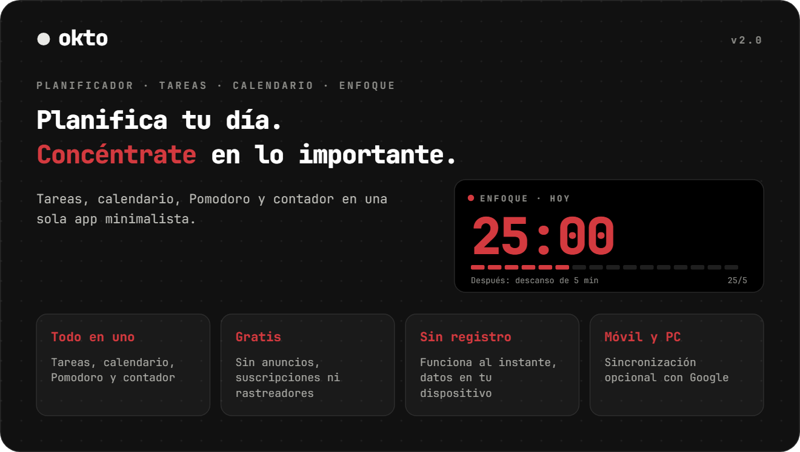
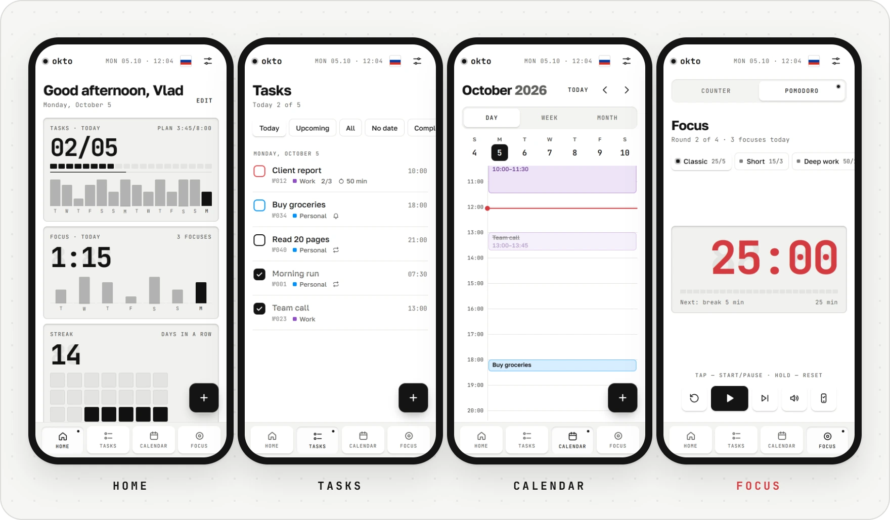
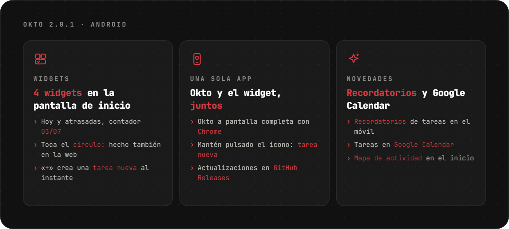
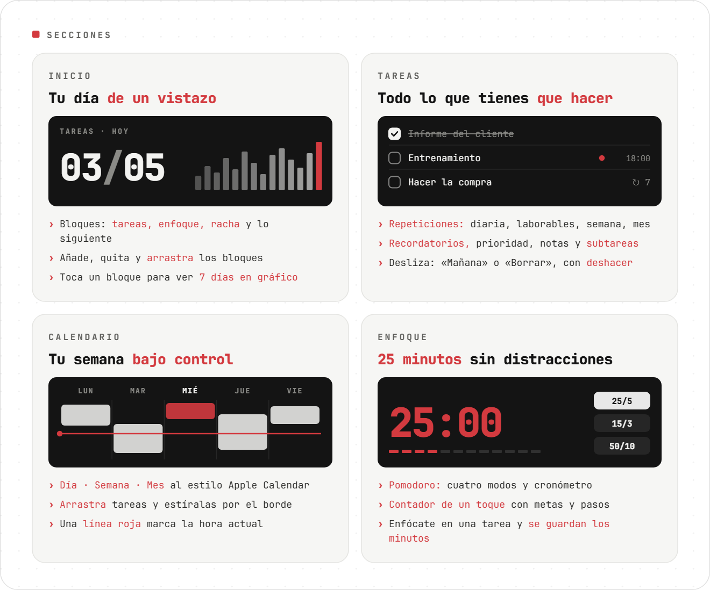
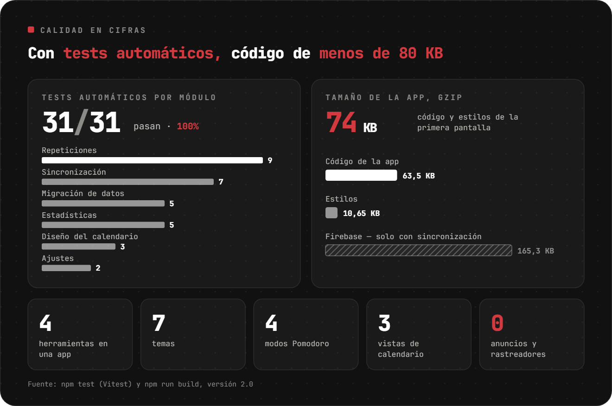
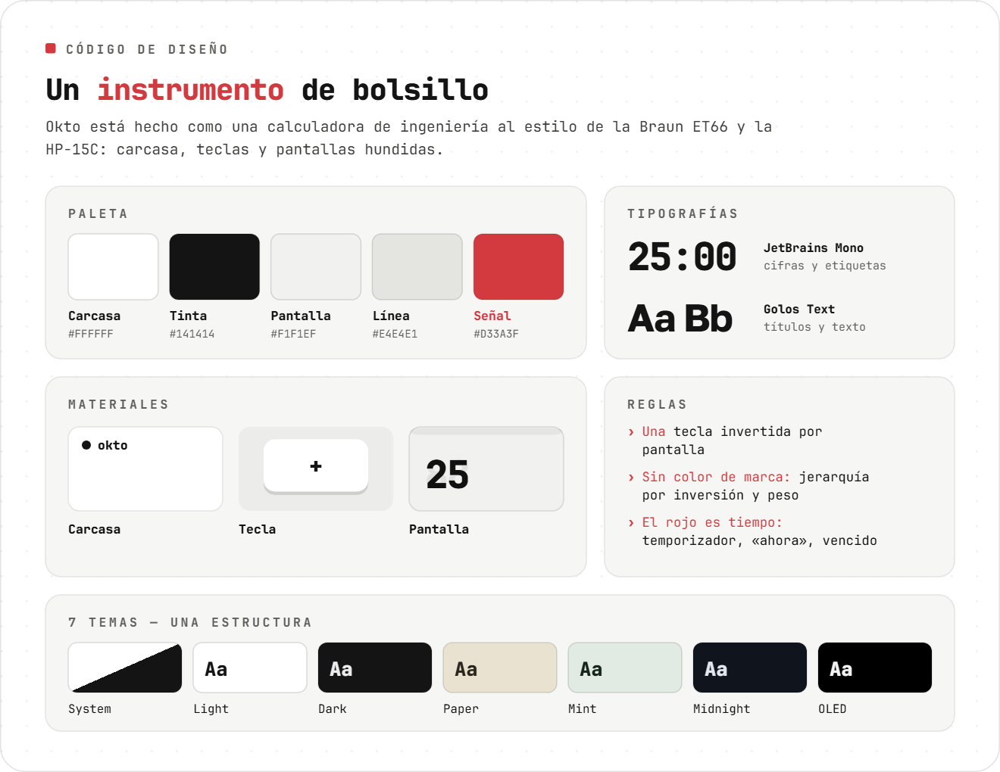
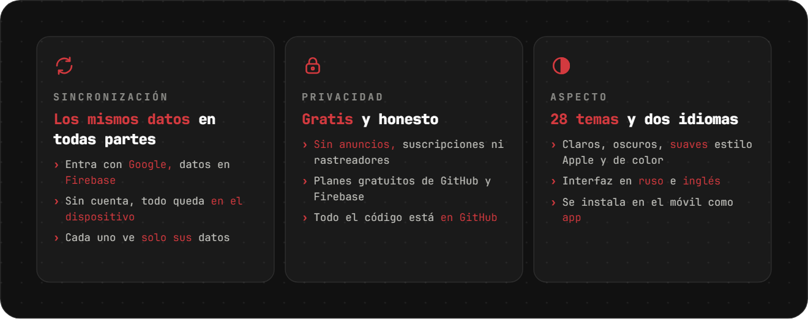
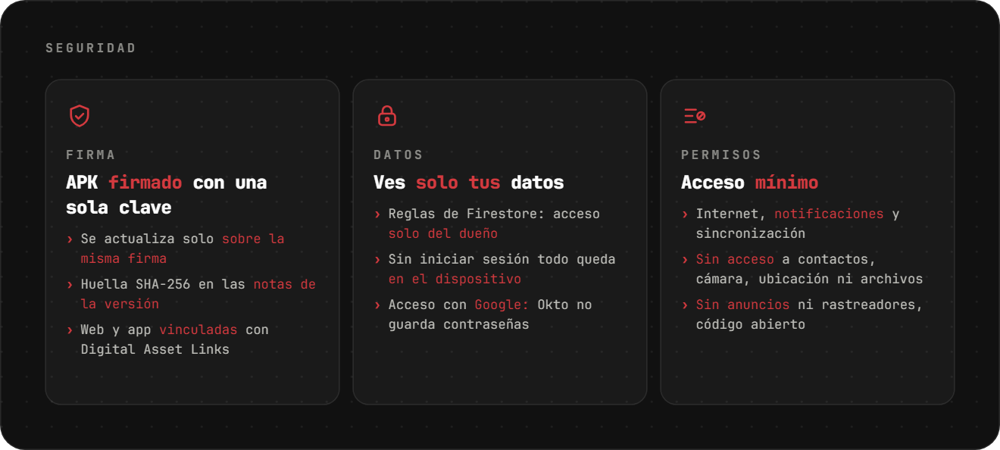

<div align="center">

[Русский](README.md) · [English](README.en.md) · **Español** · [Português](README.pt.md) · [Deutsch](README.de.md) · [Français](README.fr.md) · [Italiano](README.it.md) · [Türkçe](README.tr.md) · [Українська](README.uk.md) · [Polski](README.pl.md)

<br>

<picture><source srcset="assets/readme/hero-es.svg"></picture>

<a href="https://sailxx.github.io/Okto/"></a>&nbsp;&nbsp;<a href="https://github.com/sailxx/Okto/releases/latest/download/Okto.apk"></a>

**Okto funciona en cualquier dispositivo**: iPhone y Android, tabletas, Windows, macOS y Linux. Solo necesitas un navegador, y en el móvil o el ordenador Okto se instala como app. Para Android hay además una app con widget de tareas, también en [Komi Store](https://github.com/komi-store/komi-store).

</div>

> [!NOTE]
> La interfaz de la app está en ruso e inglés.

<br>



<br>

<picture><source srcset="assets/readme/android-es.svg"></picture>

<br>

<picture><source srcset="assets/readme/sections-es.svg"></picture>

<details>
<summary>Más sobre las secciones</summary>

### 🏠 Inicio

Tarjetas suaves de colores: **Enfoque** (minutos de Pomodoro), **Racha** (días seguidos y récord), **Siguiente** (la tarea más próxima con la línea del día), **Tareas** (hechas de las planeadas y la lista de hoy) y **contadores** para cualquier etiqueta. Las pestañas **Hoy · Semana · Totales** cambian los valores. Añade, quita, arrastra y redimensiona tarjetas con «Editar»; «Restablecer» devuelve el orden inicial. Toca una tarjeta para ver un gráfico de 7 días y el total de 30.

### ✅ Tareas

Filtros: Hoy (con vencidas), Próximas, Todas, Sin fecha, Completadas — y tus propias **listas** con colores. Una tarea tiene fecha, hora y duración, **repetición** (diaria, laborables, semanal, mensual, intervalo, fecha de fin), **recordatorio**, prioridad, nota y **subtareas**. **Enfocarse en una tarea** inicia Pomodoro y guarda los minutos en ella. En el móvil, desliza a la izquierda para «Mañana» o «Borrar»; todo se puede deshacer. Puedes adjuntar **fotos y archivos** a una tarea.

### 📅 Calendario

Al estilo Apple Calendar: **Día · Semana · Mes**, línea roja de la hora actual y fila «todo el día». Una tarea nueva aparece enseguida en el calendario. **Arrastra** bloques a otra hora o día y **estíralos** por el borde inferior (pasos de 15 minutos; en el móvil tras una pulsación larga). En las tareas repetidas Okto pregunta: solo esta, todas las futuras o toda la serie. En el móvil, el mes se pliega a una semana.

### 📝 Notas

Título, texto, color y fijado, más búsqueda en todas las notas. Adjunta **fotos de la cámara, imágenes y cualquier archivo**; los archivos se quedan en el dispositivo y solo se sincroniza su descripción. La sección se puede ocultar en los ajustes.

### 🎯 Enfoque

Contador de un toque y Pomodoro: etiquetas con metas, pasos +1/+5/+10, mantener para reiniciar, cuatro modos de Pomodoro, cronómetro y «no apagar la pantalla».

</details>

<br>

<picture><source srcset="assets/readme/quality-es.svg"></picture>

<br>

<picture><source srcset="assets/readme/design-es.svg"></picture>

<br>

<picture><source srcset="assets/readme/more-es.svg"></picture>

<details>
<summary>Cómo activar la sincronización</summary>

Por defecto Okto guarda todo en el navegador del dispositivo. Para tener los mismos datos en el móvil y el ordenador, conecta un proyecto gratuito de Firebase (plan Spark, sin tarjeta):

1. Crea un proyecto en [console.firebase.google.com](https://console.firebase.google.com/).
2. **Authentication → Sign-in method** — activa **Google**. En **Settings → Authorized domains** añade `sailxx.github.io`.
3. **Firestore Database** — crea la base de datos y pega [`firestore.rules`](firestore.rules) en la pestaña **Rules**.
4. **Project settings → Your apps → Web** — registra la app y copia `apiKey`, `authDomain`, `projectId`, `appId`.
5. En el repositorio de GitHub: **Settings → Secrets and variables → Actions** — añade los secretos `VITE_FIREBASE_API_KEY`, `VITE_FIREBASE_AUTH_DOMAIN`, `VITE_FIREBASE_PROJECT_ID`, `VITE_FIREBASE_APP_ID`.
6. Lanza el despliegue. En los ajustes de Okto aparecerá «Entrar con Google».

Estas claves no son secretas: el acceso lo protegen las reglas de Firestore y cada uno ve solo sus datos. Los recordatorios en la web funcionan mientras la pestaña está abierta. En la app de Android, los recordatorios llegan aunque Okto esté cerrado.

</details>

<br>

<picture><source srcset="assets/readme/safe-es.svg"></picture>

<br>

## 🛠 Desarrollo

```bash
npm install
npm run dev      # http://localhost:5173
npm test         # Vitest: repeticiones, estadísticas, migración, sincronización, calendario
npm run check    # svelte-check
npm run build    # compila en dist/
```

Para sincronizar en local, copia `.env.example` a `.env.local` y rellena las claves. GitHub Pages publica automáticamente con cada cambio en `main`.

## 🗂 Historial de versiones

**3.0** — sección Notas con fotos y archivos; nuevo Inicio con tarjetas suaves de colores y pestañas Hoy / Semana / Totales; barras de navegación flotantes y barra lateral plegable en escritorio; ajustes con secciones plegables; Foco renovado; correcciones de widgets en Android.

**2.2–2.8** — icono a elegir; fotos y archivos en las tareas, inicio sin conexión; mes plegable en el calendario; recordatorios de tareas en Android; tareas en Google Calendar; 14 temas nuevos claros y oscuros; tamaño de texto y tres widgets nuevos; mapa de actividad en el inicio.

**2.1** — app de Android con widget de tareas en la pantalla de inicio; temas claro y oscuro suaves al estilo Apple; Llamadas y Enfoque se pueden ocultar; el idioma se elige en Ajustes; arreglado el inicio en Android.

**2.0** — tareas con listas, repeticiones, subtareas y recordatorios; calendario al estilo Apple Calendar con arrastrar y soltar; inicio personalizable; sincronización con Firebase; enfoque en una tarea.

**1.0** — Pomodoro con cuatro modos, etiquetas con colores, siete temas, idioma inglés, notificaciones del navegador.

## ⚖️ Licencias

La fuente [Inter](https://rsms.me/inter/) usa la licencia SIL Open Font License 1.1. Las imágenes del README usan [JetBrains Mono](https://github.com/JetBrains/JetBrainsMono) (OFL 1.1) + [Golos Text](https://github.com/googlefonts/golos-text) (OFL 1.1).

<div align="center">
<br>
<sub>Hecho por [Vlad](https://t.me/arkhitkovv). Si Okto te sirvió, dale una ⭐ al repositorio.</sub>
</div>
