<div align="center">

[Русский](README.md) · [English](README.en.md) · [Español](README.es.md) · [Português](README.pt.md) · [Deutsch](README.de.md) · **Français** · [Italiano](README.it.md) · [Türkçe](README.tr.md) · [Українська](README.uk.md) · [Polski](README.pl.md)

<br>



<a href="https://sailxx.github.io/Okto/"></a>

</div>

> [!NOTE]
> L’interface de l’app est disponible en russe et en anglais.

<br>



<details>
<summary><b>En savoir plus sur les sections</b></summary>

### 🏠 Accueil

Blocs de productivité : **Tâches** (faites sur prévues), **Focus** (minutes de Pomodoro), **Série** (jours d’affilée avec une tâche ou du focus), **Ensuite** (la tâche la plus proche) et **compteurs** pour n’importe quel tag. Ajoute, retire et déplace les blocs avec le bouton « Modifier ». Touche un bloc pour un graphique sur 7 jours et le total sur 30.

### ✅ Tâches

Filtres : Aujourd’hui (avec les retards), À venir, Toutes, Sans date, Terminées — et tes propres **listes** en couleur. Une tâche a une date, une heure et une durée, une **répétition** (chaque jour, jours ouvrés, semaine, mois, intervalle, date de fin), un **rappel**, une priorité, une note et des **sous-tâches**. **Se concentrer sur une tâche** lance Pomodoro et y enregistre les minutes. Sur téléphone, balaye vers la gauche pour « Demain » ou « Supprimer » ; tout peut être annulé.

### 📅 Calendrier

Façon Apple Calendrier : **Jour · Semaine · Mois**, ligne rouge de l’heure actuelle et ligne « toute la journée ». Une nouvelle tâche apparaît tout de suite dans le calendrier. **Déplace** les blocs vers une autre heure ou un autre jour et **étire-les** par le bord inférieur (pas de 15 minutes ; sur téléphone après un appui long). Pour les tâches répétées, Okto demande : celle-ci, toutes les suivantes ou toute la série.

### 🎯 Concentration

Compteur en un geste et Pomodoro : tags prédéfinis avec objectifs, pas +1/+5/+10, appui long pour remettre à zéro, quatre modes de Pomodoro, chronomètre et « garder l’écran allumé ».

</details>

<br>



<details>
<summary><b>Activer la synchronisation</b></summary>

Par défaut, Okto garde tout dans le navigateur de l’appareil. Pour avoir les mêmes données sur téléphone et ordinateur, connecte un projet Firebase gratuit (offre Spark, sans carte) :

1. Crée un projet sur [console.firebase.google.com](https://console.firebase.google.com/).
2. **Authentication → Sign-in method** — active **Google**. Dans **Settings → Authorized domains**, ajoute `sailxx.github.io`.
3. **Firestore Database** — crée la base et colle [`firestore.rules`](firestore.rules) dans l’onglet **Rules**.
4. **Project settings → Your apps → Web** — enregistre l’app et copie `apiKey`, `authDomain`, `projectId`, `appId`.
5. Dans le dépôt GitHub : **Settings → Secrets and variables → Actions** — ajoute les secrets `VITE_FIREBASE_API_KEY`, `VITE_FIREBASE_AUTH_DOMAIN`, `VITE_FIREBASE_PROJECT_ID`, `VITE_FIREBASE_APP_ID`.
6. Lance le déploiement. « Se connecter avec Google » apparaît dans les réglages d’Okto.

Ces clés ne sont pas secrètes : l’accès est protégé par les règles Firestore, chacun ne voit que ses données. Sur le site, les rappels fonctionnent tant que l’onglet est ouvert.

</details>

<br>

## 🛠 Développement

```bash
npm install
npm run dev      # http://localhost:5173
npm test         # Vitest : répétitions, stats, migration, synchronisation, calendrier
npm run check    # svelte-check
npm run build    # build dans dist/
```

Pour la synchronisation en local, copie `.env.example` vers `.env.local` et remplis les clés. GitHub Pages publie automatiquement à chaque changement sur `main`.

## 🗂 Historique des versions

**2.0** — tâches avec listes, répétitions, sous-tâches et rappels ; calendrier façon Apple Calendrier avec glisser-déposer ; accueil personnalisable ; synchronisation Firebase ; focus sur une tâche.

**1.0** — Pomodoro à quatre modes, tags prédéfinis en couleur, sept thèmes, anglais, notifications du navigateur.

## ⚖️ Licences

La police [Inter](https://rsms.me/inter/) est sous licence SIL Open Font License 1.1. Les images du README utilisent [JetBrains Mono](https://github.com/JetBrains/JetBrainsMono) (OFL 1.1).

<div align="center">
<br>
<sub>Fait par [Vlad](https://t.me/arkhitkovv). Si Okto t’a servi, laisse une ⭐ au dépôt.</sub>
</div>
