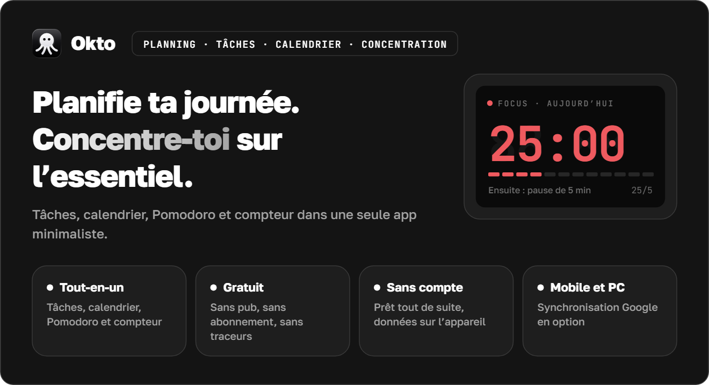
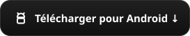
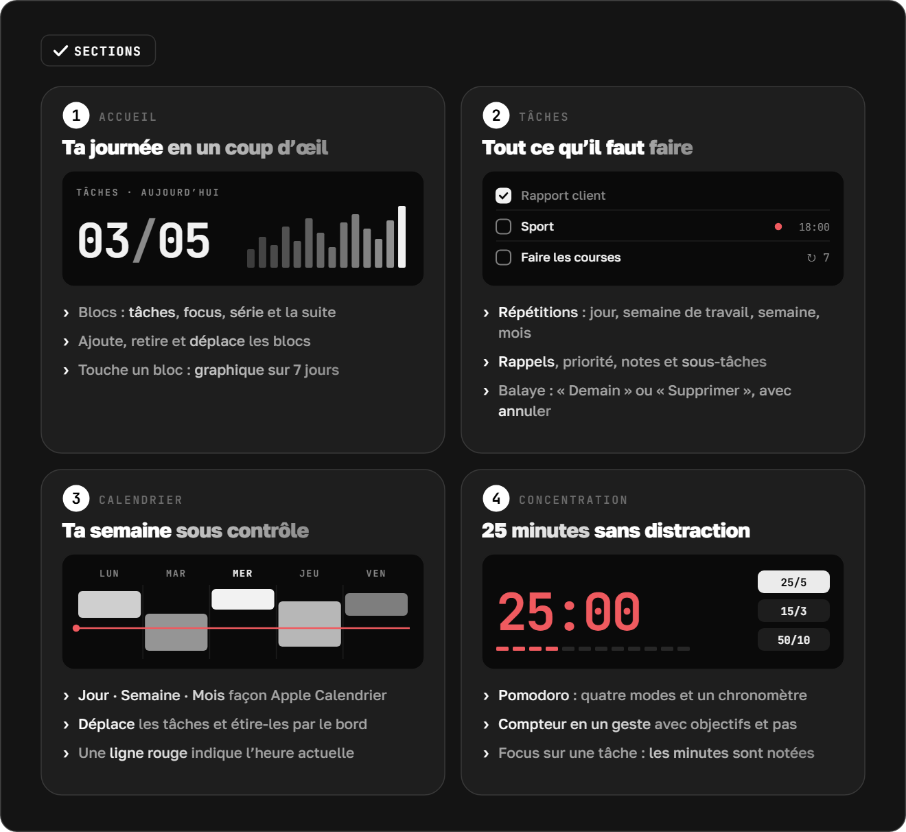
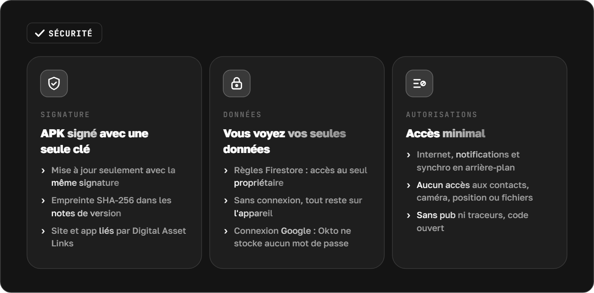
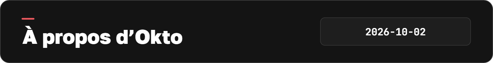

[English](README.md) · [العربية](README.ar.md) · [简体中文](README.zh-CN.md) · [繁體中文](README.zh-TW.md) · [Čeština](README.cs.md) · **Français** · [Deutsch](README.de.md) · [Ελληνικά](README.el.md) · [Bahasa Indonesia](README.id.md) · [Gaeilge](README.ga.md) · [Italiano](README.it.md) · [日本語](README.ja.md) · [한국어](README.ko.md) · [Polski](README.pl.md) · [Română](README.ro.md) · [Русский](README.ru.md) · [Español](README.es.md) · [Українська](README.uk.md) · [اردو](README.ur.md) · [ئۇيغۇرچە](README.ug.md) · [Tiếng Việt](README.vi.md) · [Português](README.pt.md) · [Türkçe](README.tr.md)

 

<picture><source srcset="assets/readme/hero-fr.svg"></picture>

&nbsp;&nbsp;&nbsp;&nbsp;

**Okto fonctionne sur tous les appareils** : iPhone et Android, tablettes, Windows, macOS et Linux. Un navigateur suffit, et Okto s'installe comme une app sur le téléphone ou l'ordinateur. Sur Android, il existe aussi une app avec widget de tâches, disponible aussi dans [Komi Store](https://github.com/komi-store/komi-store).

> [!NOTE]
> L’interface de l’app est disponible en russe et en anglais.

 

 

<picture><source srcset="assets/readme/sections-fr.svg"></picture>

 

Activer la synchronisation

Par défaut, Okto garde tout dans le navigateur de l’appareil. Pour avoir les mêmes données sur téléphone et ordinateur, connecte un projet Firebase gratuit (offre Spark, sans carte) :

1. Crée un projet sur [console.firebase.google.com](https://console.firebase.google.com/).
2. **Authentication → Sign-in method** — active **Google**. Dans **Settings → Authorized domains**, ajoute `sailxx-apps.github.io`.
3. **Firestore Database** — crée la base et colle [`firestore.rules`](firestore.rules) dans l’onglet **Rules**.
4. **Project settings → Your apps → Web** — enregistre l’app et copie `apiKey`, `authDomain`, `projectId`, `appId`.
5. Dans le dépôt GitHub : **Settings → Secrets and variables → Actions** — ajoute les secrets `VITE_FIREBASE_API_KEY`, `VITE_FIREBASE_AUTH_DOMAIN`, `VITE_FIREBASE_PROJECT_ID`, `VITE_FIREBASE_APP_ID`.
6. Lance le déploiement. « Se connecter avec Google » apparaît dans les réglages d’Okto.

Ces clés ne sont pas secrètes : l’accès est protégé par les règles Firestore, chacun ne voit que ses données. Sur le site, les rappels fonctionnent tant que l’onglet est ouvert. Dans l’app Android, les rappels arrivent même quand Okto est fermé.

 

<picture><source srcset="assets/readme/safe-fr.svg"></picture>

 

## À propos d’Okto

<picture><source srcset="assets/readme/about-fr.svg"></picture>

Okto est né le 2 octobre 2026 comme un simple compteur web. C’est aujourd’hui un outil gratuit pour les tâches, le calendrier et la concentration. Il n’y a ni publicité, ni statistiques d’utilisation, ni traceurs. Vos données restent sur votre appareil et la synchronisation via Google Firebase est facultative. [Sécurité : signature, données, autorisations](PRIVACY.md)

## Feuille de route

<picture><source srcset="assets/readme/roadmap-fr.svg"></picture>

**2026-10-02** — Le premier Okto était un compteur en un geste, avec un objectif et un chronomètre.

**1.0** — Pomodoro à quatre modes, tags prédéfinis en couleur, sept thèmes, anglais, notifications du navigateur.

**2.0** — tâches avec listes, répétitions, sous-tâches et rappels ; calendrier façon Apple Calendrier avec glisser-déposer ; accueil personnalisable ; synchronisation Firebase ; focus sur une tâche.

**2.1** — app Android avec widget de tâches sur l'écran d'accueil ; thèmes clair et sombre doux style Apple ; Appels et Focus masquables ; langue dans les Réglages ; lancement corrigé sur Android.

**2.2–2.8** — icône au choix ; photos et fichiers dans les tâches, lancement hors ligne ; mois repliable dans le calendrier ; rappels de tâches sur Android ; tâches dans Google Agenda ; 14 nouveaux thèmes clairs et sombres ; taille du texte et trois nouveaux widgets ; carte d'activité sur l'accueil.

**3.0** — section Notes avec photos et fichiers ; nouvel Accueil avec cartes douces et colorées et onglets Aujourd’hui / Semaine / Totaux ; barres de navigation flottantes et barre latérale repliable sur ordinateur ; réglages à sections repliables ; Focus remanié ; correctifs des widgets Android.

[**3.23.6**](https://github.com/sailxx/Okto/releases/tag/v3.23.6) — Okto a gagné une application dans la zone de notification de Windows. Le planificateur Android s’ouvre hors ligne et la version 3.23.6 améliore les pièces jointes et l’écran de concentration.

## ⚖️ Licences

La police [Inter](https://rsms.me/inter/) est sous licence SIL Open Font License 1.1. Les images du README utilisent [JetBrains Mono](https://github.com/JetBrains/JetBrainsMono) (OFL 1.1) + [Golos Text](https://github.com/googlefonts/golos-text) (OFL 1.1).
