<div align="center">

[Русский](README.md) · [English](README.en.md) · [Español](README.es.md) · [Português](README.pt.md) · [Deutsch](README.de.md) · [Français](README.fr.md) · **Italiano** · [Türkçe](README.tr.md) · [Українська](README.uk.md) · [Polski](README.pl.md)

<br>



<a href="https://sailxx.github.io/Okto/"></a>&nbsp;&nbsp;<a href="https://github.com/sailxx/Okto/releases/latest/download/Okto.apk"></a>

**Okto funziona su qualsiasi dispositivo**: iPhone e Android, tablet, Windows, macOS e Linux. Basta un browser, e su telefono o computer Okto si installa come app. Per Android c'è anche un'app con widget delle attività, disponibile anche su [Komi Store](https://github.com/komi-store/komi-store).

</div>

> [!NOTE]
> L’interfaccia dell’app è in russo e inglese.

<br>


<br>



<br>



<details>
<summary><b>Di più sulle sezioni</b></summary>

### 🏠 Home

Blocchi di produttività: **Attività** (fatte su pianificate), **Focus** (minuti di Pomodoro), **Serie** (giorni di fila con un’attività o focus), **Prossima** (l’attività più vicina) e **contatori** per qualsiasi tag. Aggiungi, togli e trascina i blocchi con il pulsante «Modifica». Tocca un blocco per il grafico di 7 giorni e il totale di 30.

### ✅ Attività

Filtri: Oggi (con le scadute), In arrivo, Tutte, Senza data, Completate — e le tue **liste** a colori. Un’attività ha data, ora e durata, **ripetizione** (ogni giorno, feriali, settimana, mese, intervallo, data di fine), **promemoria**, priorità, nota e **sottoattività**. **Focus su un’attività** avvia il Pomodoro e salva i minuti. Sul telefono scorri a sinistra per «Domani» o «Elimina»; ogni azione si può annullare.

### 📅 Calendario

In stile Apple Calendario: **Giorno · Settimana · Mese**, linea rossa dell’ora attuale e riga «tutto il giorno». Una nuova attività compare subito nel calendario. **Trascina** i blocchi su un’altra ora o giorno e **allungali** dal bordo inferiore (passi di 15 minuti; sul telefono dopo una pressione lunga). Per le attività ripetute Okto chiede: solo questa, tutte le future o l’intera serie.

### 🎯 Focus

Contatore a un tocco e Pomodoro: tag predefiniti con obiettivi, passi +1/+5/+10, tieni premuto per azzerare, quattro modalità di Pomodoro, cronometro e «schermo sempre acceso».

</details>

<br>



<br>



<br>



<details>
<summary><b>Come attivare la sincronizzazione</b></summary>

Di base Okto salva tutto nel browser del dispositivo. Per avere gli stessi dati su telefono e computer, collega un progetto Firebase gratuito (piano Spark, senza carta):

1. Crea un progetto su [console.firebase.google.com](https://console.firebase.google.com/).
2. **Authentication → Sign-in method** — attiva **Google**. In **Settings → Authorized domains** aggiungi `sailxx.github.io`.
3. **Firestore Database** — crea il database e incolla [`firestore.rules`](firestore.rules) nella scheda **Rules**.
4. **Project settings → Your apps → Web** — registra l’app e copia `apiKey`, `authDomain`, `projectId`, `appId`.
5. Nel repository GitHub: **Settings → Secrets and variables → Actions** — aggiungi i secret `VITE_FIREBASE_API_KEY`, `VITE_FIREBASE_AUTH_DOMAIN`, `VITE_FIREBASE_PROJECT_ID`, `VITE_FIREBASE_APP_ID`.
6. Avvia il deploy. Nelle impostazioni di Okto comparirà «Accedi con Google».

Queste chiavi non sono segrete: l’accesso è protetto dalle regole di Firestore e ognuno vede solo i propri dati. I promemoria sul sito funzionano finché la scheda è aperta.

</details>

<br>



<br>

## 🛠 Sviluppo

```bash
npm install
npm run dev      # http://localhost:5173
npm test         # Vitest: ripetizioni, statistiche, migrazione, sincronizzazione, calendario
npm run check    # svelte-check
npm run build    # build in dist/
```

Per la sincronizzazione in locale, copia `.env.example` in `.env.local` e compila le chiavi. GitHub Pages pubblica automaticamente a ogni modifica su `main`.

## 🗂 Cronologia versioni

**2.1** — app Android con widget delle attività nella schermata Home; temi chiaro e scuro morbidi in stile Apple; Chiamate e Focus nascondibili; lingua nelle Impostazioni; corretto l'avvio su Android.

**2.0** — attività con liste, ripetizioni, sottoattività e promemoria; calendario in stile Apple Calendario con trascinamento; home personalizzabile; sincronizzazione con Firebase; focus su un’attività.

**1.0** — Pomodoro con quattro modalità, tag colorati, sette temi, inglese, notifiche del browser.

## ⚖️ Licenze

Il font [Inter](https://rsms.me/inter/) è distribuito con la SIL Open Font License 1.1. Le immagini del README usano [JetBrains Mono](https://github.com/JetBrains/JetBrainsMono) (OFL 1.1) + [Golos Text](https://github.com/googlefonts/golos-text) (OFL 1.1).

<div align="center">
<br>
<sub>Fatto da [Vlad](https://t.me/arkhitkovv). Se Okto ti è utile, lascia una ⭐ al repository.</sub>
</div>
