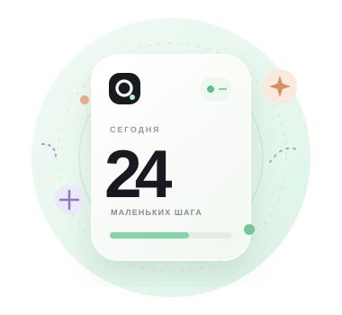

# Okto

### Маленький шаг. Большой прогресс.

Минималистичный счётчик, который помогает замечать каждый шаг к вашей цели.

[**Открыть веб‑версию →**](https://sailxx.github.io/Okto/)

 

## Ваш ритм — ваши правила

Okto превращает простое нажатие в понятный прогресс. Задайте цель, считайте в своём темпе и возвращайтесь к своему результату в любое время.

| Возможность | Что делает |
| --- | --- |
| **Счётчик в один тап** | Нажмите на число или клавиши `Пробел` и `Enter`, чтобы добавить единицу. |
| **Цель и прогресс** | Выберите количество нажатий и следите за заполнением шкалы. |
| **Шаг назад и сброс** | Исправьте последнее действие или начните счёт заново. |
| **Светлая и тёмная темы** | Выберите оформление, которое подходит вашему времени суток. |
| **Автосохранение** | Счёт, цель и тема останутся в том же браузере. |
| **Удобно на любом экране** | Адаптивная вёрстка работает на телефонах, планшетах и компьютерах. |
| **Поделиться результатом** | Отправьте свой счёт через системное меню браузера. |

## Посмотрите поближе

Лаконичный экран оставляет главное в центре внимания. Остальное — рядом, когда понадобится.

## Начать пользоваться

**[Перейти к Okto](https://sailxx.github.io/Okto/)** — приложение откроется прямо в браузере. Установка и регистрация не нужны.

Счёт хранится локально в браузере на вашем устройстве. Чтобы открыть его с другого устройства, начните новый счёт там.

## Запустить у себя

1. Скачайте или клонируйте этот репозиторий.
2. Откройте `index.html` в современном браузере.

Приложение собрано на обычных HTML, CSS и JavaScript — сборка и дополнительные пакеты не требуются.

## Технологии

HTML · CSS · JavaScript · GitHub Pages

---

Создано для маленьких побед. <strong>okto.</strong>

