<div align="center">

**Русский** · [English](README.en.md) · [Español](README.es.md) · [Português](README.pt.md) · [Deutsch](README.de.md) · [Français](README.fr.md) · [Italiano](README.it.md) · [Türkçe](README.tr.md) · [Українська](README.uk.md) · [Polski](README.pl.md)

<br>



<a href="https://sailxx.github.io/Okto/"></a>&nbsp;&nbsp;<a href="https://github.com/sailxx/Okto/releases/latest/download/Okto.apk"></a>

**Okto работает на любом устройстве** — iPhone и Android, планшет, Windows, macOS и Linux. Нужен только браузер, а на телефон и компьютер Okto ставится как приложение. Для Android есть отдельное приложение с виджетом задач — его можно найти и в [Komi Store](https://github.com/komi-store/komi-store).

</div>

<br>


<br>



<br>



<details>
<summary><b>Подробнее о разделах</b></summary>

### 🏠 Главная

Блоки продуктивности: **Задачи** (выполнено из запланированного), **Фокус** (минуты Pomodoro), **Серия** (дней подряд с задачей или фокусом), **Дальше** (ближайшая задача) и **счётчики** по любому тегу. Блоки можно добавлять, убирать и перетаскивать — кнопка «Изменить». Тап по блоку показывает график за 7 дней и итог за 30.

### ✅ Задачи

Фильтры: Сегодня (с просроченными), Предстоящие, Все, Без даты, Выполненные — и ваши **списки** с цветами. У задачи есть дата, время и длительность, **повтор** (каждый день, по будням, неделя, месяц, интервал, дата окончания), **напоминание**, приоритет, заметка и **подзадачи**. **Фокус на задаче** запускает Pomodoro, и минуты записываются в задачу. На телефоне свайп влево — «На завтра» или «Удалить», после любого действия можно отменить.

### 📅 Календарь

В стиле Apple Calendar: **День · Неделя · Месяц**, красная линия текущего времени, строка «весь день». Новая задача сразу появляется в календаре. Блоки можно **перетаскивать** на другое время и день и **растягивать** за нижний край (шаг 15 минут; на телефоне — после долгого нажатия). Для повторяющихся задач Okto спросит: только эту, все будущие или всю серию.

### 🎯 Фокус

Счётчик в один тап и Pomodoro: теги-заготовки с целями, шаг +1/+5/+10, удержание — сброс, четыре режима Pomodoro, секундомер и «не гасить экран».

</details>

<br>



<br>



<br>



<details>
<summary><b>Как включить синхронизацию</b></summary>

Без настройки Okto хранит всё в браузере на устройстве. Чтобы данные были одинаковыми на телефоне и компьютере, подключите бесплатный Firebase (план Spark, карта не нужна):

1. Создайте проект на [console.firebase.google.com](https://console.firebase.google.com/).
2. **Authentication → Sign-in method** — включите **Google**. В **Settings → Authorized domains** добавьте `sailxx.github.io`.
3. **Firestore Database** — создайте базу и во вкладке **Rules** вставьте содержимое [`firestore.rules`](firestore.rules).
4. **Project settings → Your apps → Web** — зарегистрируйте приложение и скопируйте `apiKey`, `authDomain`, `projectId`, `appId`.
5. В репозитории на GitHub: **Settings → Secrets and variables → Actions** — добавьте секреты `VITE_FIREBASE_API_KEY`, `VITE_FIREBASE_AUTH_DOMAIN`, `VITE_FIREBASE_PROJECT_ID`, `VITE_FIREBASE_APP_ID`.
6. Запустите деплой. В настройках Okto появится «Войти через Google».

Эти ключи не секретные — доступ защищают правила Firestore: каждый видит только свои данные. Напоминания на сайте срабатывают, пока вкладка открыта.

</details>

<br>



<br>

## 🛠 Разработка

```bash
npm install
npm run dev      # http://localhost:5173
npm test         # Vitest: повторы, статистика, перенос данных, синхронизация, раскладка календаря
npm run check    # svelte-check
npm run build    # сборка в dist/
```

Для синхронизации локально скопируйте `.env.example` в `.env.local` и заполните ключи. Публикация на GitHub Pages — автоматически при каждом изменении в `main`.

## 🗂 История версий

**2.1** — Android-приложение с виджетом задач на рабочем столе; мягкие светлая и тёмная темы в стиле Apple; разделы «Созвоны» и «Фокус» можно скрыть; язык меняется в настройках; исправлен запуск на Android.

**2.0** — задачи со списками, повторами, подзадачами и напоминаниями; календарь в стиле Apple Calendar с перетаскиванием; главная с настраиваемыми блоками; синхронизация через Firebase; фокус на задаче.

**1.0** — Pomodoro с четырьмя режимами, теги-заготовки с цветами, семь тем, английский язык, уведомления в браузере.

## ⚖️ Лицензии

Шрифт [Inter](https://rsms.me/inter/) распространяется по лицензии SIL Open Font License 1.1. Картинки README набраны шрифтом [JetBrains Mono](https://github.com/JetBrains/JetBrainsMono) (OFL 1.1) + [Golos Text](https://github.com/googlefonts/golos-text) (OFL 1.1).

<div align="center">
<br>
<sub>Сделал [Владислав](https://t.me/arkhitkovv). Если Okto пригодился, поставь ⭐ репозиторию.</sub>
</div>
