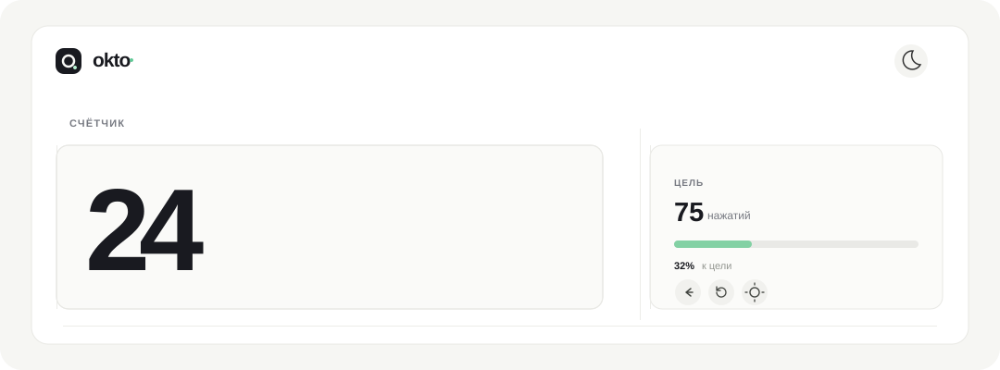

# Okto — счётчик

[Открыть веб‑версию](https://sailxx.github.io/Okto/)

Простой счётчик для телефона и компьютера. Интерфейс сосредоточен на счёте и цели.

## Возможности

- Увеличение счёта нажатием на число или клавишами `Пробел` и `Enter`
- Настраиваемая цель и индикатор прогресса
- Шаг назад и сброс счёта
- Светлая и тёмная темы
- Автосохранение счёта, цели и темы в браузере
- Отправка результата через системное меню браузера
- Адаптивный интерфейс

## Запуск

Откройте `index.html` в современном браузере. Установка и сборка не нужны.

Данные счётчика хранятся локально в браузере. Они не синхронизируются между устройствами.

## Технологии

HTML · CSS · JavaScript · GitHub Pages
