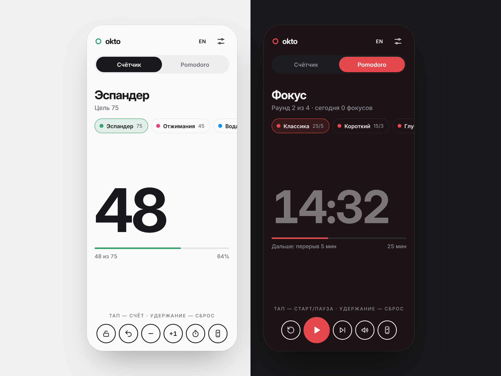

<div align="center">


# Okto

**Счётчик в один тап. Без регистрации, рекламы и лишних кнопок.**

Повторения в зале, круги на дорожке, страницы, стаканы воды, петли в вязании —
открываете ссылку и просто нажимаете на экран.

<a href="https://sailxx.github.io/Okto/"></a>

<br><br>



</div>

<br>

## Почему Okto

|  |  |
|---|---|
| **Тап в любом месте** | Весь экран — одна большая кнопка. Не нужно целиться, можно считать не глядя |
| **Цель и прогресс** | Задайте цель — Okto покажет процент и даст знать, когда она достигнута |
| **Секундомер** | Засекайте подход или тренировку прямо рядом со счётом |
| **Отмена и сброс** | Ошиблись — кнопка отмены. Долгое нажатие обнуляет счёт, и это тоже можно отменить |
| **Блокировка** | Положили телефон в карман — замок не даст насчитать лишнего |
| **Шаг +1 / +5 / +10** | Для больших чисел, когда считать по одному долго |
| **Светлая и тёмная тема** | По умолчанию подстраивается под систему |
| **Приватно** | Никаких аккаунтов, серверов и трекеров. Всё хранится только на вашем устройстве |

## Как пользоваться

1. Откройте **[sailxx.github.io/Okto](https://sailxx.github.io/Okto/)** на телефоне или компьютере
2. Нажмите на ⚙ и дайте счётчику имя и цель
3. Нажимайте на экран. Удерживайте палец, чтобы обнулить

**На компьютере:** <kbd>Пробел</kbd> или <kbd>Enter</kbd> — прибавить, <kbd>Z</kbd> — отменить.

**Как приложение:** в браузере телефона выберите «Добавить на главный экран» — Okto откроется без адресной строки, как обычное приложение.

## Под капотом

Чистые HTML, CSS и JavaScript — ни фреймворков, ни сборки, ни внешних запросов. Шрифт Inter подключён локально, страница весит меньше 150 КБ.

```text
Okto/
├── index.html            разметка
├── style.css             минималистичная тема, светлая и тёмная
├── app.js                счёт, цель, секундомер, жесты, сохранение
├── manifest.webmanifest  установка на главный экран
└── assets/               иконки, шрифты, превью
```

Данные — счёт, цель, название, шаг, тема и секундомер — лежат в `localStorage` браузера. Если очистить данные сайта, счёт обнулится.

Запуск локально: скачайте репозиторий и откройте `index.html`. Публикация на GitHub Pages происходит автоматически при пуше в `main`.

## Лицензия

Шрифт [Inter](https://rsms.me/inter/) распространяется по лицензии SIL Open Font License 1.1.

<div align="center">
<br>
<sub>Если Okto пригодился — поставьте ⭐ репозиторию, это помогает проекту</sub>
</div>
