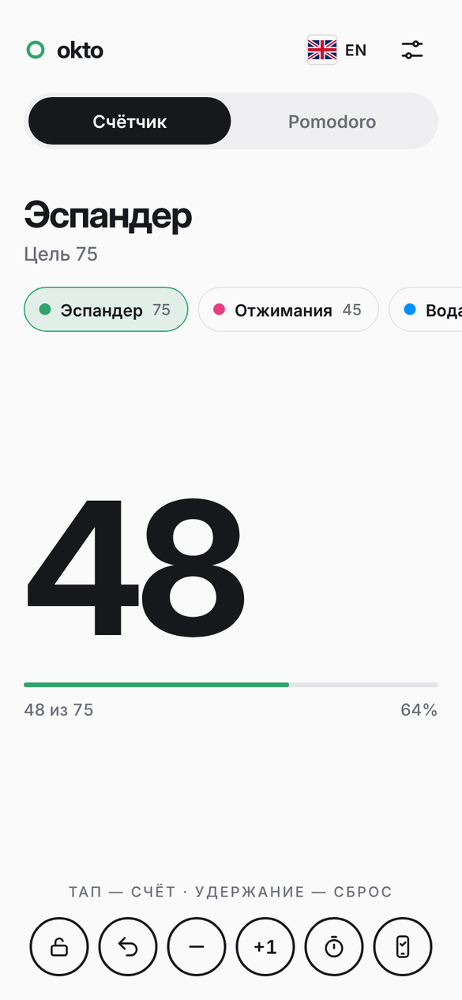
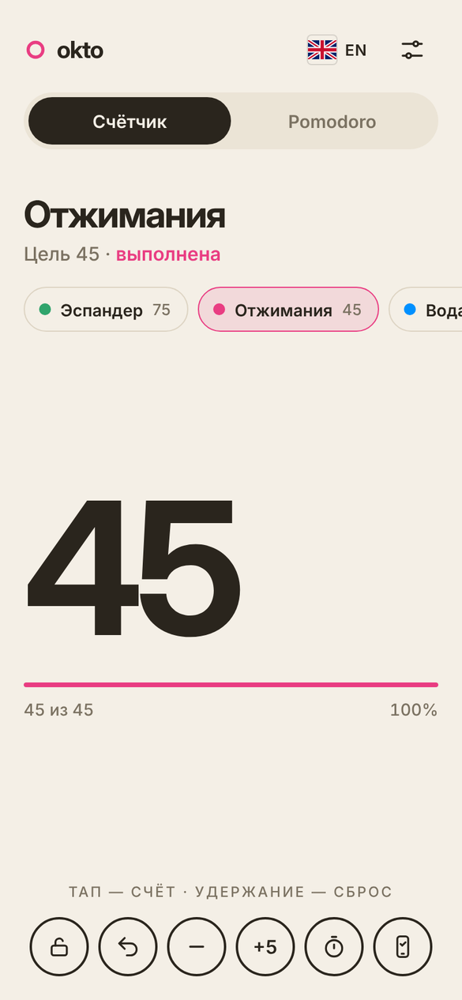
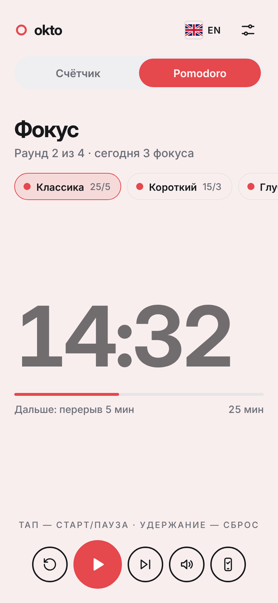
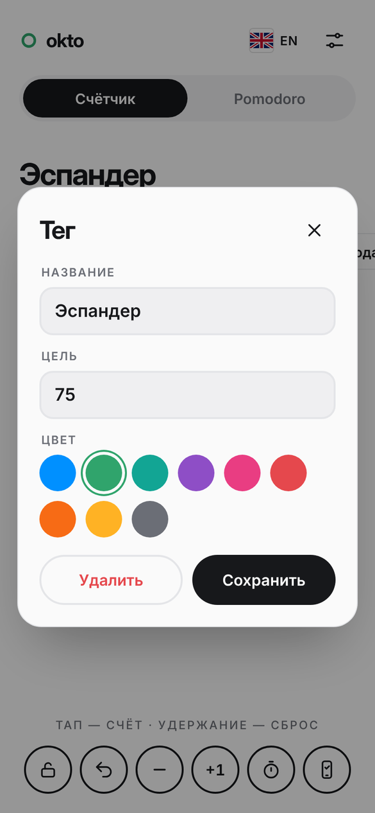
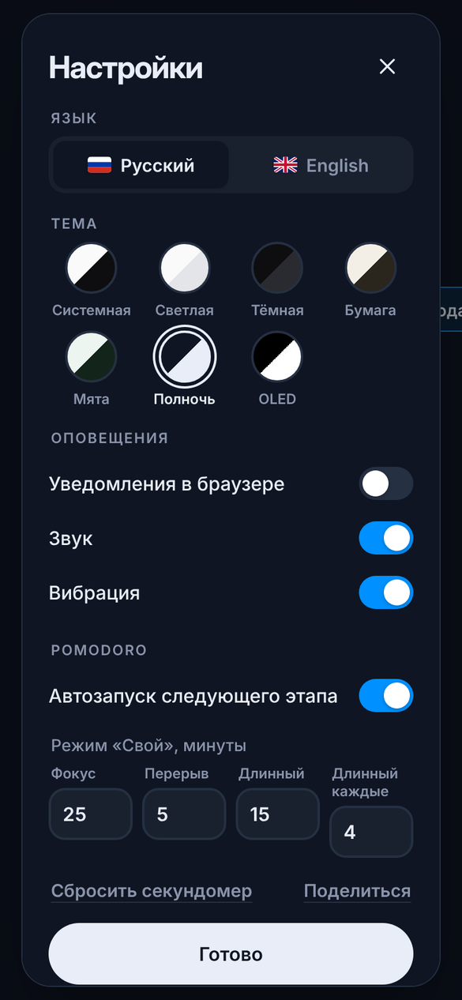
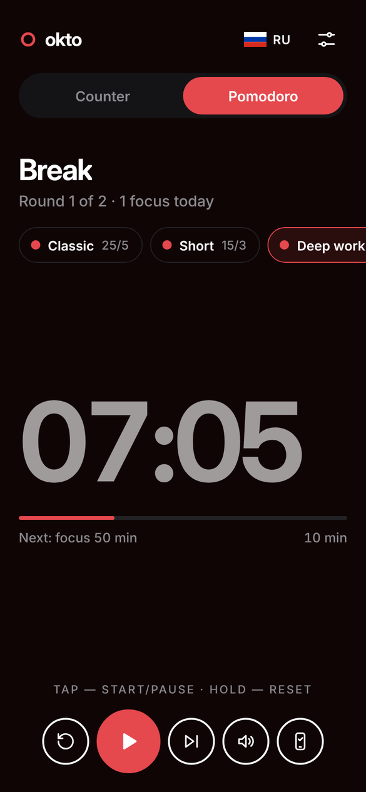
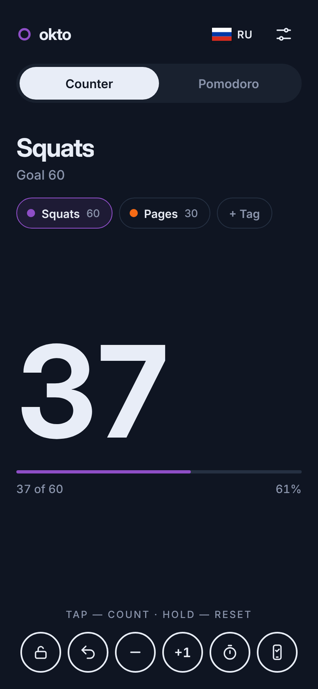
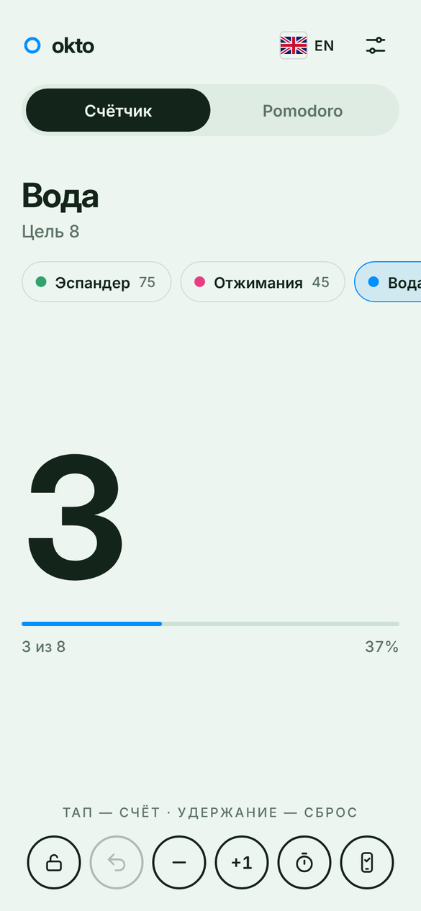

<div align="center">


# Okto

### Счётчик в один тап и Pomodoro‑таймер

Повторения в зале, стаканы воды, страницы книги, фокус‑сессии —
откройте ссылку и просто нажимайте на экран. Без регистрации, рекламы и установки.

<a href="https://sailxx.github.io/Okto/"></a>
&nbsp;


<br>


<br>


</div>

<br>

## Представляем Okto 1.0

Okto начинался как маленький счётчик, а в версии 1.0 стал полноценным инструментом на каждый день. Всё так же минималистичный — одно большое число и пара кнопок, — но теперь умеет хранить несколько заготовок, работать как Pomodoro‑таймер, присылать уведомления и говорить по‑английски.

<br>

## Экраны

<table>
  <tr>
    <td align="center"><br><sub><b>Счётчик</b><br>тап в любом месте экрана</sub></td>
    <td align="center"><br><sub><b>Цель выполнена</b><br>тема «Бумага», шаг +5</sub></td>
    <td align="center"><br><sub><b>Pomodoro</b><br>красный акцент в режиме фокуса</sub></td>
    <td align="center"><br><sub><b>Теги‑заготовки</b><br>название, цель и цвет</sub></td>
  </tr>
  <tr>
    <td align="center"><br><sub><b>Настройки</b><br>язык, темы, оповещения</sub></td>
    <td align="center"><br><sub><b>English</b><br>Pomodoro в теме OLED</sub></td>
    <td align="center"><br><sub><b>Тема «Полночь»</b><br>для работы ночью</sub></td>
    <td align="center"><br><sub><b>Тема «Мята»</b><br>спокойная и светлая</sub></td>
  </tr>
</table>

<br>

## Возможности

### 🔢 Счётчик

- **Весь экран — одна кнопка.** Не нужно целиться: тапайте куда угодно, можно считать не глядя.
- **Удержание — сброс.** Долгое нажатие обнуляет счёт, а отмена возвращает всё назад.
- **Шаг +1, +5 или +10** — для больших чисел.
- **Цель и прогресс.** Тонкая линия показывает, сколько осталось, а при достижении цели приходит уведомление.
- **Кнопки‑кружочки:** блокировка от случайных нажатий, отмена, −1, шаг, секундомер и «не гасить экран».

### 🏷️ Теги‑заготовки

Создайте заготовку под каждое занятие: «Эспандер · 75», «Отжимания · 45», «Вода · 8». У каждого тега свой счёт, своя цель, свой шаг и свой цвет из девяти. Переключение — одним тапом, редактирование — повторным тапом по активному тегу.

### 🍅 Pomodoro

- **Четыре режима:** Классика 25/5, Короткий 15/3, Глубокий 50/10 и Свой с любыми минутами.
- **Длинный перерыв** каждые N фокусов, номер раунда и счётчик фокусов за сегодня.
- **Автозапуск** следующего этапа — можно отключить.
- **Красный акцент.** При переключении на Pomodoro весь интерфейс окрашивается в красный, чтобы режимы невозможно было перепутать.
- Таймер считает по реальному времени, поэтому не сбивается, даже если закрыть вкладку.

### 🔔 Уведомления

Okto пришлёт уведомление в браузере, когда **цель достигнута** и когда **закончился этап Pomodoro**. Дополнительно — короткий звуковой сигнал и вибрация на телефоне. Каждое оповещение включается отдельно в настройках.

### 🎨 Семь тем

Системная · Светлая · Тёмная · Бумага · Мята · Полночь · OLED. Системная тема сама переключается вслед за телефоном или компьютером.

### 🇷🇺 🇬🇧 Два языка

Русский и английский. Язык определяется автоматически, а переключатель с флагом всегда под рукой в верхнем углу.

### 🔒 Приватность

Никаких аккаунтов, серверов, рекламы и трекеров. Все данные хранятся только в браузере на вашем устройстве.

<br>

## Как пользоваться

1. Откройте **[sailxx.github.io/Okto](https://sailxx.github.io/Okto/)** на телефоне или компьютере.
2. Нажмите **+ Тег**, задайте название, цель и цвет.
3. Нажимайте на экран. Удерживайте палец, чтобы обнулить.
4. Для работы и учёбы переключитесь на **Pomodoro** и нажмите ▶.
5. В настройках включите **уведомления в браузере**, чтобы не пропустить конец таймера.

| Клавиша | Действие |
|---|---|
| <kbd>Пробел</kbd> / <kbd>Enter</kbd> | Счёт или старт/пауза Pomodoro |
| <kbd>Z</kbd> | Отменить последнее действие |

**Как приложение:** в браузере телефона выберите «Добавить на главный экран» — Okto откроется без адресной строки, как обычное приложение.

<br>

## Под капотом

Чистые HTML, CSS и JavaScript — ни фреймворков, ни сборки, ни внешних запросов. Шрифт Inter подключён локально, вся страница весит меньше 180 КБ.

```text
Okto/
├── index.html            разметка
├── style.css             темы, режимы и адаптивная вёрстка
├── app.js                счётчик, теги, Pomodoro, языки, уведомления
├── sw.js                 service worker для системных уведомлений
├── manifest.webmanifest  установка на главный экран
└── assets/               иконки, шрифты, превью и экраны
```

Данные — теги, счёт, цели, настройки Pomodoro и тема — лежат в `localStorage`. Старые сохранения из предыдущих версий переносятся автоматически.

Запуск локально: скачайте репозиторий и откройте `index.html`. Публикация на GitHub Pages происходит автоматически при каждом изменении в `main`.

<br>

## История версий

**1.0** — Pomodoro с четырьмя режимами, теги‑заготовки с цветами, семь тем, английский язык, уведомления в браузере, новые кнопки и минималистичный дизайн.

<br>

## Лицензия

Шрифт [Inter](https://rsms.me/inter/) распространяется по лицензии SIL Open Font License 1.1.

<div align="center">
<br>
<sub>Если Okto пригодился — поставьте ⭐ репозиторию, это помогает проекту</sub>
</div>
