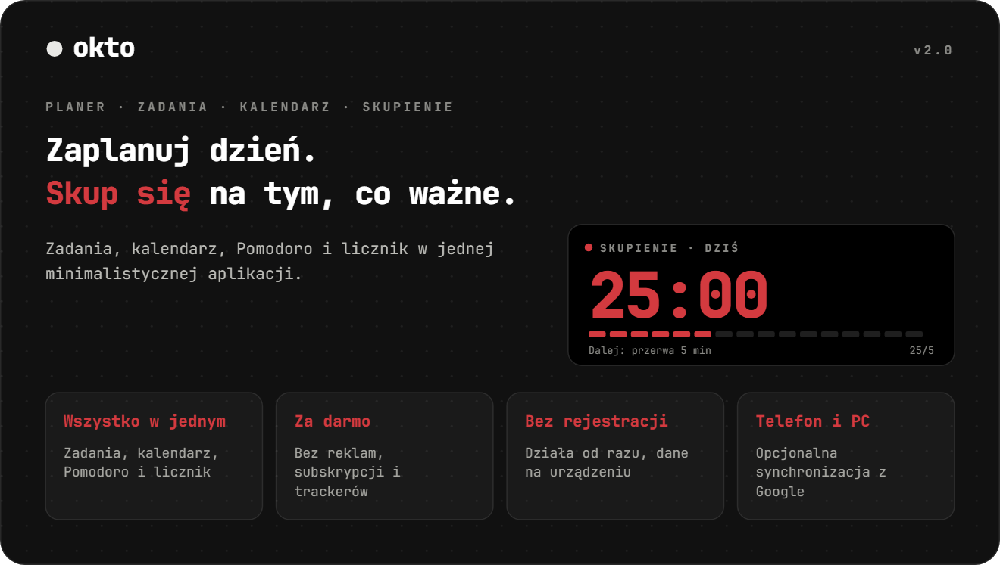
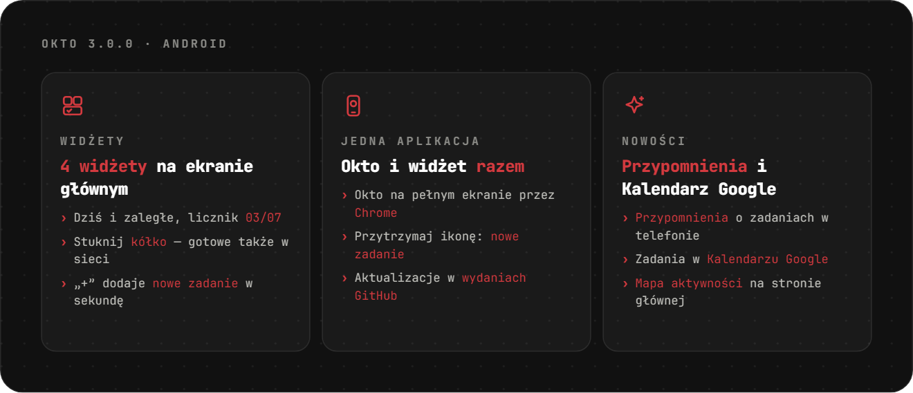
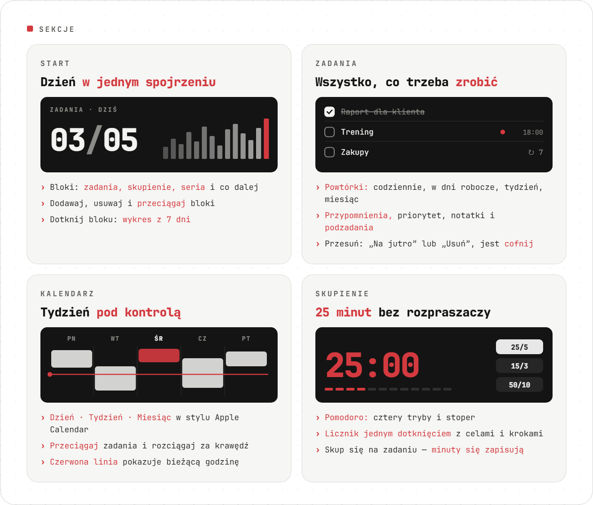
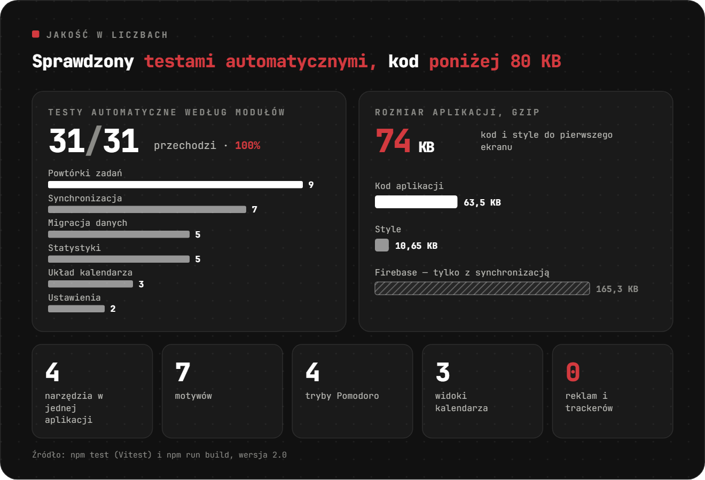
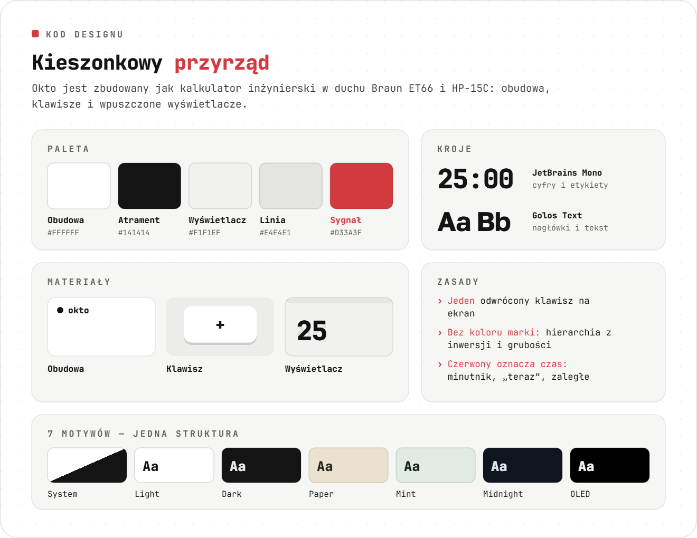
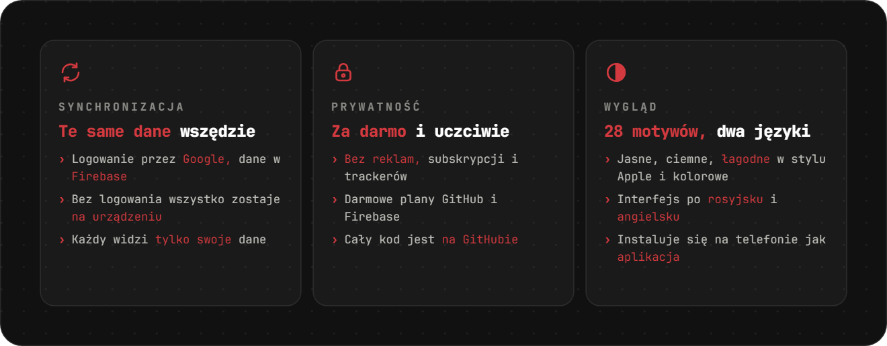
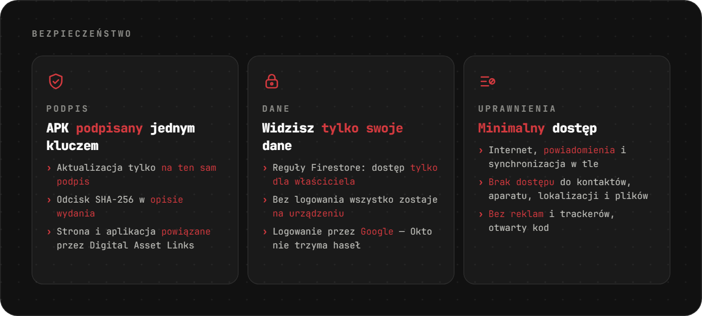

<div align="center">

[Русский](README.md) · [English](README.en.md) · [Español](README.es.md) · [Português](README.pt.md) · [Deutsch](README.de.md) · [Français](README.fr.md) · [Italiano](README.it.md) · [Türkçe](README.tr.md) · [Українська](README.uk.md) · **Polski**

<br>

<picture><source srcset="assets/readme/hero-pl.svg"></picture>

<a href="https://sailxx.github.io/Okto/"></a>&nbsp;&nbsp;<a href="https://github.com/sailxx/Okto/releases/latest/download/Okto.apk"></a>

**Okto działa na każdym urządzeniu** — iPhone i Android, tablet, Windows, macOS i Linux. Wystarczy przeglądarka, a na telefonie i komputerze Okto instaluje się jak aplikacja. Na Androida jest też osobna aplikacja z widżetem zadań — znajdziesz ją także w [Komi Store](https://github.com/komi-store/komi-store).

</div>

> [!NOTE]
> Interfejs aplikacji jest po rosyjsku i angielsku.

<br>


<br>

<picture><source srcset="assets/readme/android-pl.svg"></picture>

<br>

<picture><source srcset="assets/readme/sections-pl.svg"></picture>

<details>
<summary>Więcej o sekcjach</summary>

### 🏠 Start

Bloki produktywności: **Zadania** (wykonane z zaplanowanych), **Skupienie** (minuty Pomodoro), **Seria** (mapa aktywności z tym, co zrobione każdego dnia, bieżąca seria i rekord), **Dalej** (najbliższe zadanie) i **liczniki** dla dowolnego tagu. Bloki dodasz, usuniesz i przeciągniesz przyciskiem „Edytuj”. Dotknięcie bloku pokazuje wykres z 7 dni i sumę z 30.

### ✅ Zadania

Filtry: Dziś (z zaległymi), Nadchodzące, Wszystkie, Bez daty, Ukończone — oraz własne kolorowe **listy**. Zadanie ma datę, godzinę i czas trwania, **powtarzanie** (codziennie, dni robocze, co tydzień, co miesiąc, interwał, data końca), **przypomnienie**, priorytet, notatkę i **podzadania**. **Skupienie na zadaniu** uruchamia Pomodoro i zapisuje minuty w zadaniu. Na telefonie przesuń w lewo: „Na jutro” lub „Usuń”; każdą akcję można cofnąć. Do zadania można dołączyć **zdjęcia i pliki**.

### 📅 Kalendarz

W stylu Apple Calendar: **Dzień · Tydzień · Miesiąc**, czerwona linia bieżącej godziny i wiersz „cały dzień”. Nowe zadanie od razu pojawia się w kalendarzu. Bloki można **przeciągać** na inną godzinę lub dzień i **rozciągać** za dolną krawędź (krok 15 minut; na telefonie po długim przytrzymaniu). Przy zadaniach cyklicznych Okto zapyta: tylko to, wszystkie przyszłe czy całą serię. Na telefonie miesiąc zwija się do tygodnia.

### 🎯 Skupienie

Licznik jednym dotknięciem i Pomodoro: gotowe tagi z celami, kroki +1/+5/+10, przytrzymanie — reset, cztery tryby Pomodoro, stoper i „nie wygaszaj ekranu”.

</details>

<br>

<picture><source srcset="assets/readme/quality-pl.svg"></picture>

<br>

<picture><source srcset="assets/readme/design-pl.svg"></picture>

<br>

<picture><source srcset="assets/readme/more-pl.svg"></picture>

<details>
<summary>Jak włączyć synchronizację</summary>

Domyślnie Okto trzyma wszystko w przeglądarce na urządzeniu. Aby mieć te same dane na telefonie i komputerze, podłącz darmowy projekt Firebase (plan Spark, bez karty):

1. Utwórz projekt na [console.firebase.google.com](https://console.firebase.google.com/).
2. **Authentication → Sign-in method** — włącz **Google**. W **Settings → Authorized domains** dodaj `sailxx.github.io`.
3. **Firestore Database** — utwórz bazę i wklej [`firestore.rules`](firestore.rules) w zakładce **Rules**.
4. **Project settings → Your apps → Web** — zarejestruj aplikację i skopiuj `apiKey`, `authDomain`, `projectId`, `appId`.
5. W repozytorium na GitHubie: **Settings → Secrets and variables → Actions** — dodaj sekrety `VITE_FIREBASE_API_KEY`, `VITE_FIREBASE_AUTH_DOMAIN`, `VITE_FIREBASE_PROJECT_ID`, `VITE_FIREBASE_APP_ID`.
6. Uruchom wdrożenie. W ustawieniach Okto pojawi się „Zaloguj przez Google”.

Te klucze nie są tajne — dostęp chronią reguły Firestore, każdy widzi tylko swoje dane. Przypomnienia na stronie działają, dopóki karta jest otwarta. W aplikacji na Androida przypomnienia przychodzą, nawet gdy Okto jest zamknięte.

</details>

<br>

<picture><source srcset="assets/readme/safe-pl.svg"></picture>

<br>

## 🛠 Rozwój

```bash
npm install
npm run dev      # http://localhost:5173
npm test         # Vitest: powtórki, statystyki, migracja, synchronizacja, kalendarz
npm run check    # svelte-check
npm run build    # build do dist/
```

Do synchronizacji lokalnie skopiuj `.env.example` do `.env.local` i uzupełnij klucze. GitHub Pages publikuje automatycznie przy każdej zmianie w `main`.

## 🗂 Historia wersji

**2.2–2.8** — ikona do wyboru; zdjęcia i pliki w zadaniach, uruchamianie offline; zwijany miesiąc w kalendarzu; przypomnienia o zadaniach na Androidzie; zadania w Kalendarzu Google; 14 nowych jasnych i ciemnych motywów; rozmiar tekstu i trzy nowe widżety; mapa aktywności na stronie głównej.

**2.1** — aplikacja na Androida z widżetem zadań na ekranie głównym; łagodne jasny i ciemny motyw w stylu Apple; Rozmowy i Fokus można ukryć; język w Ustawieniach; naprawione uruchamianie na Androidzie.

**2.0** — zadania z listami, powtórkami, podzadaniami i przypomnieniami; kalendarz w stylu Apple Calendar z przeciąganiem; konfigurowalny ekran startowy; synchronizacja przez Firebase; skupienie na zadaniu.

**1.0** — Pomodoro z czterema trybami, kolorowe gotowe tagi, siedem motywów, język angielski, powiadomienia w przeglądarce.

## ⚖️ Licencje

Czcionka [Inter](https://rsms.me/inter/) jest na licencji SIL Open Font License 1.1. Obrazy w README używają [JetBrains Mono](https://github.com/JetBrains/JetBrainsMono) (OFL 1.1) + [Golos Text](https://github.com/googlefonts/golos-text) (OFL 1.1).

<div align="center">
<br>
<sub>Zrobił [Vlad](https://t.me/arkhitkovv). Jeśli Okto ci się przydał, zostaw ⭐ w repozytorium.</sub>
</div>
