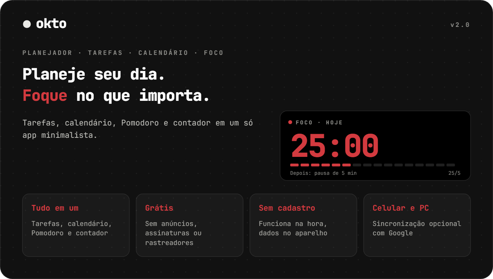
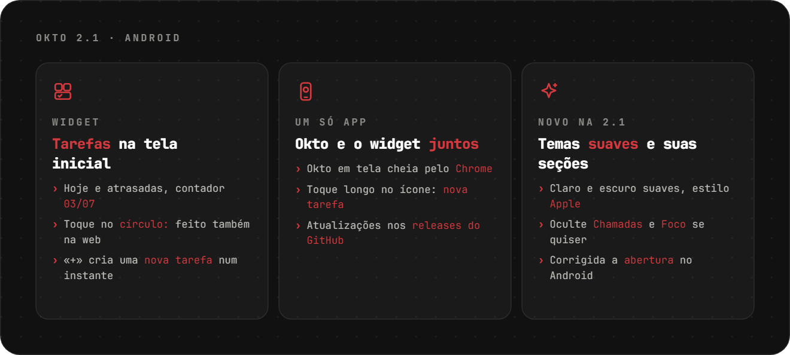
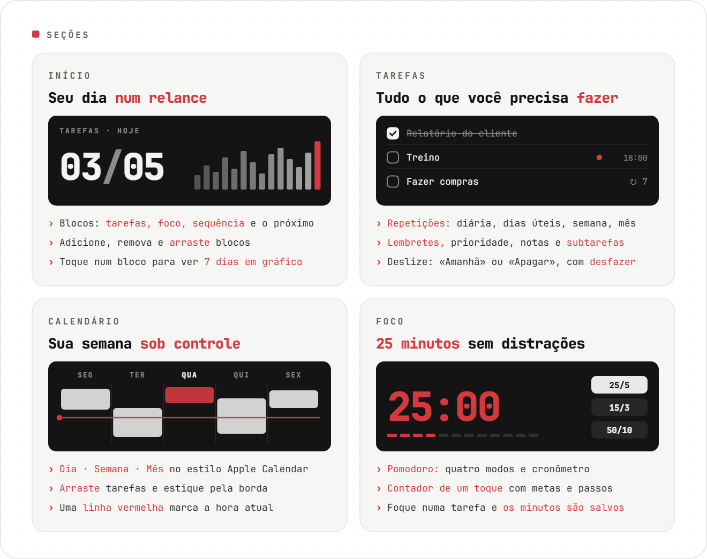
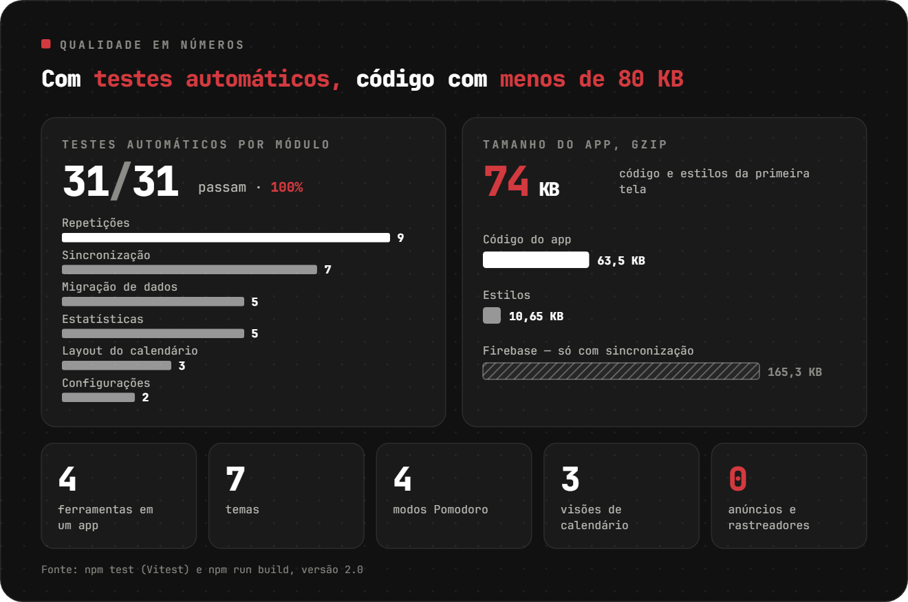
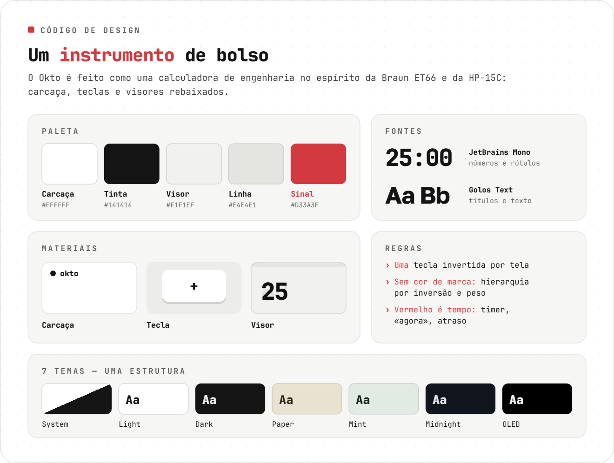
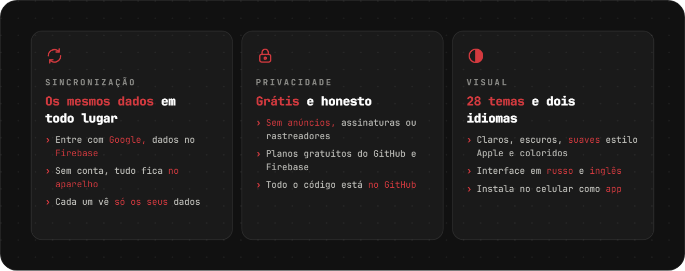
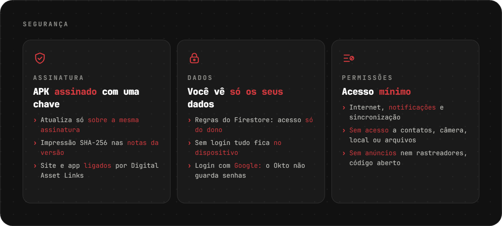

<div align="center">

[Русский](README.md) · [English](README.en.md) · [Español](README.es.md) · **Português** · [Deutsch](README.de.md) · [Français](README.fr.md) · [Italiano](README.it.md) · [Türkçe](README.tr.md) · [Українська](README.uk.md) · [Polski](README.pl.md)

<br>

<picture><source srcset="assets/readme/hero-pt.svg"></picture>

<a href="https://sailxx.github.io/Okto/"></a>&nbsp;&nbsp;<a href="https://github.com/sailxx/Okto/releases/latest/download/Okto.apk"></a>

**O Okto funciona em qualquer dispositivo**: iPhone e Android, tablets, Windows, macOS e Linux. Basta um navegador, e no celular ou no computador o Okto se instala como app. Para Android há também um app com widget de tarefas, disponível também na [Komi Store](https://github.com/komi-store/komi-store).

</div>

> [!NOTE]
> A interface do app está em russo e inglês.

<br>


<br>

<picture><source srcset="assets/readme/android-pt.svg"></picture>

<br>

<picture><source srcset="assets/readme/sections-pt.svg"></picture>

<details>
<summary>Mais sobre as seções</summary>

### 🏠 Início

Blocos de produtividade: **Tarefas** (feitas das planejadas), **Foco** (minutos de Pomodoro), **Sequência** (mapa de atividade com o que foi feito a cada dia, sequência atual e recorde), **Próxima** (a tarefa mais próxima) e **contadores** por qualquer etiqueta. Adicione, remova e arraste blocos pelo botão «Editar». Toque num bloco para ver o gráfico de 7 dias e o total de 30.

### ✅ Tarefas

Filtros: Hoje (com atrasadas), Próximas, Todas, Sem data, Concluídas — e suas próprias **listas** com cores. A tarefa tem data, hora e duração, **repetição** (diária, dias úteis, semanal, mensal, intervalo, data final), **lembrete**, prioridade, nota e **subtarefas**. **Focar numa tarefa** inicia o Pomodoro e salva os minutos nela. No celular, deslize para a esquerda para «Amanhã» ou «Apagar»; tudo pode ser desfeito. Dá para anexar **fotos e arquivos** a uma tarefa.

### 📅 Calendário

No estilo Apple Calendar: **Dia · Semana · Mês**, linha vermelha da hora atual e linha «dia inteiro». Uma tarefa nova aparece no calendário na hora. **Arraste** blocos para outro horário ou dia e **estique** pela borda inferior (passos de 15 minutos; no celular após um toque longo). Em tarefas repetidas o Okto pergunta: só esta, todas as futuras ou a série inteira. No celular, o mês recolhe para uma semana.

### 🎯 Foco

Contador de um toque e Pomodoro: etiquetas com metas, passos +1/+5/+10, segurar para zerar, quatro modos de Pomodoro, cronômetro e «não apagar a tela».

</details>

<br>

<picture><source srcset="assets/readme/quality-pt.svg"></picture>

<br>

<picture><source srcset="assets/readme/design-pt.svg"></picture>

<br>

<picture><source srcset="assets/readme/more-pt.svg"></picture>

<details>
<summary>Como ativar a sincronização</summary>

Por padrão o Okto guarda tudo no navegador do aparelho. Para ter os mesmos dados no celular e no computador, conecte um projeto gratuito do Firebase (plano Spark, sem cartão):

1. Crie um projeto em [console.firebase.google.com](https://console.firebase.google.com/).
2. **Authentication → Sign-in method** — ative o **Google**. Em **Settings → Authorized domains** adicione `sailxx.github.io`.
3. **Firestore Database** — crie o banco e cole [`firestore.rules`](firestore.rules) na aba **Rules**.
4. **Project settings → Your apps → Web** — registre o app e copie `apiKey`, `authDomain`, `projectId`, `appId`.
5. No repositório do GitHub: **Settings → Secrets and variables → Actions** — adicione os secrets `VITE_FIREBASE_API_KEY`, `VITE_FIREBASE_AUTH_DOMAIN`, `VITE_FIREBASE_PROJECT_ID`, `VITE_FIREBASE_APP_ID`.
6. Rode o deploy. Nas configurações do Okto aparecerá «Entrar com Google».

Essas chaves não são secretas: o acesso é protegido pelas regras do Firestore e cada um vê só os próprios dados. Os lembretes no site funcionam enquanto a aba está aberta. No app para Android, os lembretes chegam mesmo com o Okto fechado.

</details>

<br>

<picture><source srcset="assets/readme/safe-pt.svg"></picture>

<br>

## 🛠 Desenvolvimento

```bash
npm install
npm run dev      # http://localhost:5173
npm test         # Vitest: repetições, estatísticas, migração, sincronização, calendário
npm run check    # svelte-check
npm run build    # gera o build em dist/
```

Para sincronizar localmente, copie `.env.example` para `.env.local` e preencha as chaves. O GitHub Pages publica automaticamente a cada mudança em `main`.

## 🗂 Histórico de versões

**2.2–2.8** — ícone à escolha; fotos e arquivos nas tarefas, abertura offline; mês recolhível no calendário; lembretes de tarefas no Android; tarefas no Google Agenda; 14 temas novos claros e escuros; tamanho do texto e três widgets novos; mapa de atividade no início.

**2.1** — app Android com widget de tarefas na tela inicial; temas claro e escuro suaves no estilo Apple; Chamadas e Foco podem ser ocultados; o idioma fica nas Configurações; corrigida a abertura no Android.

**2.0** — tarefas com listas, repetições, subtarefas e lembretes; calendário no estilo Apple Calendar com arrastar e soltar; início personalizável; sincronização com Firebase; foco numa tarefa.

**1.0** — Pomodoro com quatro modos, etiquetas coloridas, sete temas, idioma inglês, notificações do navegador.

## ⚖️ Licenças

A fonte [Inter](https://rsms.me/inter/) usa a licença SIL Open Font License 1.1. As imagens do README usam [JetBrains Mono](https://github.com/JetBrains/JetBrainsMono) (OFL 1.1) + [Golos Text](https://github.com/googlefonts/golos-text) (OFL 1.1).

<div align="center">
<br>
<sub>Feito por [Vlad](https://t.me/arkhitkovv). Se o Okto te ajudou, deixe uma ⭐ no repositório.</sub>
</div>
