<div align="center">

[Русский](README.md) · [English](README.en.md) · [Español](README.es.md) · [Português](README.pt.md) · [Deutsch](README.de.md) · [Français](README.fr.md) · [Italiano](README.it.md) · **Türkçe** · [Українська](README.uk.md) · [Polski](README.pl.md)

<br>



<a href="https://sailxx.github.io/Okto/"></a>

</div>

> [!NOTE]
> Uygulama arayüzü Rusça ve İngilizcedir.

<br>


<br>



<details>
<summary><b>Bölümler hakkında daha fazlası</b></summary>

### 🏠 Ana sayfa

Verimlilik blokları: **Görevler** (planlananlardan yapılanlar), **Odak** (Pomodoro dakikaları), **Seri** (görev ya da odakla geçen ardışık günler), **Sıradaki** (en yakın görev) ve herhangi bir etiket için **sayaçlar**. «Düzenle» düğmesiyle blok ekle, kaldır ve sürükle. Bir bloğa dokununca 7 günlük grafik ve 30 günlük toplam görünür.

### ✅ Görevler

Filtreler: Bugün (gecikenlerle), Yaklaşan, Tümü, Tarihsiz, Tamamlanan — ve kendi renkli **listelerin**. Bir görevin tarihi, saati ve süresi, **tekrarı** (her gün, hafta içi, haftalık, aylık, aralık, bitiş tarihi), **hatırlatıcısı**, önceliği, notu ve **alt görevleri** vardır. **Bir göreve odaklanmak** Pomodoro’yu başlatır ve dakikaları göreve yazar. Telefonda sola kaydır: «Yarına» ya da «Sil»; her işlem geri alınabilir.

### 📅 Takvim

Apple Takvim tarzında: **Gün · Hafta · Ay**, şu anki saati gösteren kırmızı çizgi ve «tüm gün» satırı. Yeni görev hemen takvimde görünür. Blokları başka bir saate ya da güne **sürükle** ve alt kenarından **uzat** (15 dakikalık adımlar; telefonda uzun basınca). Tekrarlanan görevlerde Okto sorar: yalnızca bu, sonrakilerin hepsi ya da tüm seri.

### 🎯 Odak

Tek dokunuşla sayaç ve Pomodoro: hedefli hazır etiketler, +1/+5/+10 adımlar, sıfırlamak için basılı tut, dört Pomodoro modu, kronometre ve «ekranı açık tut».

</details>

<br>



<br>



<br>



<details>
<summary><b>Senkronizasyonu açma</b></summary>

Okto varsayılan olarak her şeyi cihazdaki tarayıcıda tutar. Telefonda ve bilgisayarda aynı verilere sahip olmak için ücretsiz bir Firebase projesi bağla (Spark planı, kart gerekmez):

1. [console.firebase.google.com](https://console.firebase.google.com/) adresinde bir proje oluştur.
2. **Authentication → Sign-in method** — **Google**’ı aç. **Settings → Authorized domains** altına `sailxx.github.io` ekle.
3. **Firestore Database** — veritabanını oluştur ve **Rules** sekmesine [`firestore.rules`](firestore.rules) içeriğini yapıştır.
4. **Project settings → Your apps → Web** — uygulamayı kaydet ve `apiKey`, `authDomain`, `projectId`, `appId` değerlerini kopyala.
5. GitHub deposunda: **Settings → Secrets and variables → Actions** — `VITE_FIREBASE_API_KEY`, `VITE_FIREBASE_AUTH_DOMAIN`, `VITE_FIREBASE_PROJECT_ID`, `VITE_FIREBASE_APP_ID` secret’larını ekle.
6. Yayınlamayı başlat. Okto ayarlarında «Google ile giriş yap» görünür.

Bu anahtarlar gizli değildir: erişimi Firestore kuralları korur, herkes yalnızca kendi verisini görür. Sitedeki hatırlatıcılar sekme açıkken çalışır.

</details>

<br>

## 🛠 Geliştirme

```bash
npm install
npm run dev      # http://localhost:5173
npm test         # Vitest: tekrarlar, istatistik, veri taşıma, senkronizasyon, takvim
npm run check    # svelte-check
npm run build    # dist/ içine derler
```

Yerelde senkronizasyon için `.env.example` dosyasını `.env.local` olarak kopyala ve anahtarları doldur. GitHub Pages, `main`’deki her değişiklikte otomatik yayınlar.

## 🗂 Sürüm geçmişi

**2.0** — listeli, tekrarlı, alt görevli ve hatırlatıcılı görevler; sürükle-bırak destekli Apple Takvim tarzı takvim; özelleştirilebilir ana sayfa; Firebase senkronizasyonu; göreve odaklanma.

**1.0** — dört modlu Pomodoro, renkli hazır etiketler, yedi tema, İngilizce, tarayıcı bildirimleri.

## ⚖️ Lisanslar

[Inter](https://rsms.me/inter/) yazı tipi SIL Open Font License 1.1 ile lisanslıdır. README görselleri [JetBrains Mono](https://github.com/JetBrains/JetBrainsMono) (OFL 1.1) + [Golos Text](https://github.com/googlefonts/golos-text) (OFL 1.1) ile dizilmiştir.

<div align="center">
<br>
<sub>[Vlad](https://t.me/arkhitkovv) tarafından yapıldı. Okto işine yaradıysa depoya bir ⭐ bırak.</sub>
</div>
