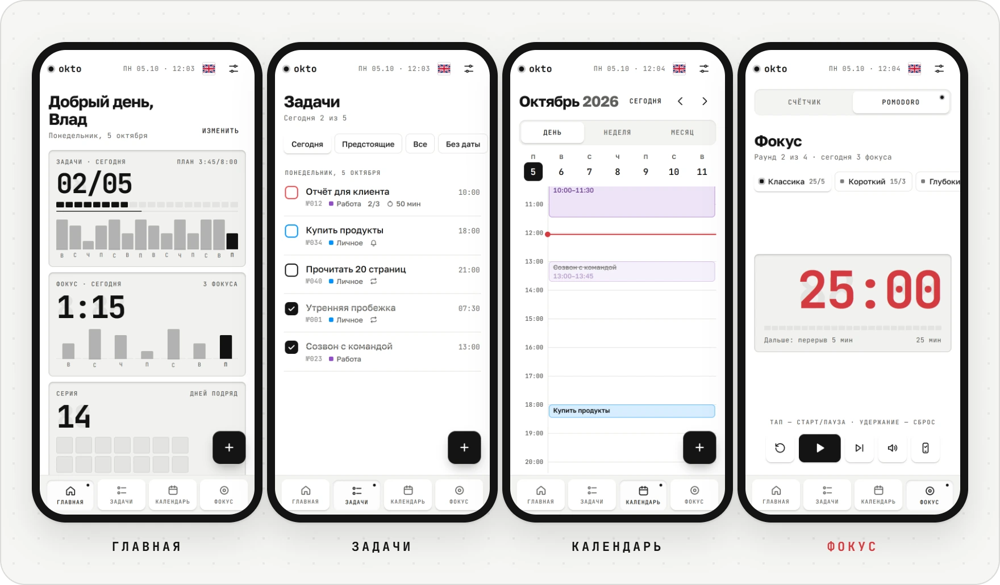

<div align="center">

[Русский](README.md) · [English](README.en.md) · [Español](README.es.md) · [Português](README.pt.md) · [Deutsch](README.de.md) · [Français](README.fr.md) · [Italiano](README.it.md) · [Türkçe](README.tr.md) · **Українська** · [Polski](README.pl.md)

<br>



<a href="https://sailxx.github.io/Okto/"></a>&nbsp;&nbsp;<a href="https://github.com/sailxx/Okto/releases/latest/download/Okto.apk"></a>

**Okto працює на будь-якому пристрої** — iPhone і Android, планшет, Windows, macOS і Linux. Потрібен лише браузер, а на телефон і комп'ютер Okto встановлюється як застосунок. Для Android є окремий застосунок із віджетом завдань — його можна знайти й у [Komi Store](https://github.com/komi-store/komi-store).

</div>

> [!NOTE]
> Інтерфейс застосунку доступний російською та англійською.

<br>



<br>



<br>



<details>
<summary><b>Докладніше про розділи</b></summary>

### 🏠 Головна

Блоки продуктивності: **Завдання** (виконано із запланованого), **Фокус** (хвилини Pomodoro), **Серія** (днів поспіль із завданням або фокусом), **Далі** (найближче завдання) і **лічильники** за будь-яким тегом. Блоки можна додавати, прибирати й перетягувати — кнопка «Змінити». Тап по блоку показує графік за 7 днів і підсумок за 30.

### ✅ Завдання

Фільтри: Сьогодні (з простроченими), Майбутні, Усі, Без дати, Виконані — і ваші **списки** з кольорами. У завдання є дата, час і тривалість, **повтор** (щодня, у будні, щотижня, щомісяця, інтервал, дата завершення), **нагадування**, пріоритет, нотатка і **підзавдання**. **Фокус на завданні** запускає Pomodoro, і хвилини записуються в завдання. На телефоні свайп ліворуч — «На завтра» або «Видалити», будь-яку дію можна скасувати.

### 📅 Календар

У стилі Apple Calendar: **День · Тиждень · Місяць**, червона лінія поточного часу, рядок «увесь день». Нове завдання одразу з’являється в календарі. Блоки можна **перетягувати** на інший час і день та **розтягувати** за нижній край (крок 15 хвилин; на телефоні — після довгого натискання). Для повторюваних завдань Okto спитає: лише це, усі майбутні чи всю серію.

### 🎯 Фокус

Лічильник в один тап і Pomodoro: теги-заготовки з цілями, крок +1/+5/+10, утримання — скидання, чотири режими Pomodoro, секундомір і «не вимикати екран».

</details>

<br>



<br>



<br>



<details>
<summary><b>Як увімкнути синхронізацію</b></summary>

Без налаштування Okto зберігає все в браузері на пристрої. Щоб дані були однаковими на телефоні й комп’ютері, підключіть безкоштовний Firebase (план Spark, картка не потрібна):

1. Створіть проєкт на [console.firebase.google.com](https://console.firebase.google.com/).
2. **Authentication → Sign-in method** — увімкніть **Google**. У **Settings → Authorized domains** додайте `sailxx.github.io`.
3. **Firestore Database** — створіть базу й у вкладці **Rules** вставте вміст [`firestore.rules`](firestore.rules).
4. **Project settings → Your apps → Web** — зареєструйте застосунок і скопіюйте `apiKey`, `authDomain`, `projectId`, `appId`.
5. У репозиторії на GitHub: **Settings → Secrets and variables → Actions** — додайте секрети `VITE_FIREBASE_API_KEY`, `VITE_FIREBASE_AUTH_DOMAIN`, `VITE_FIREBASE_PROJECT_ID`, `VITE_FIREBASE_APP_ID`.
6. Запустіть деплой. У налаштуваннях Okto з’явиться «Увійти через Google».

Ці ключі не секретні — доступ захищають правила Firestore: кожен бачить лише свої дані. Нагадування на сайті спрацьовують, поки вкладка відкрита.

</details>

<br>



<br>

## 🛠 Розробка

```bash
npm install
npm run dev      # http://localhost:5173
npm test         # Vitest: повтори, статистика, перенесення даних, синхронізація, календар
npm run check    # svelte-check
npm run build    # збірка в dist/
```

Для синхронізації локально скопіюйте `.env.example` у `.env.local` і заповніть ключі. Публікація на GitHub Pages — автоматично після кожної зміни в `main`.

## 🗂 Історія версій

**2.1** — Android-застосунок із віджетом завдань на робочому столі; м'які світла й темна теми в стилі Apple; «Дзвінки» і «Фокус» можна сховати; мова — в налаштуваннях; виправлено запуск на Android.

**2.0** — завдання зі списками, повторами, підзавданнями й нагадуваннями; календар у стилі Apple Calendar з перетягуванням; головна з налаштовуваними блоками; синхронізація через Firebase; фокус на завданні.

**1.0** — Pomodoro з чотирма режимами, теги-заготовки з кольорами, сім тем, англійська мова, сповіщення в браузері.

## ⚖️ Ліцензії

Шрифт [Inter](https://rsms.me/inter/) поширюється за ліцензією SIL Open Font License 1.1. Зображення README набрані шрифтом [JetBrains Mono](https://github.com/JetBrains/JetBrainsMono) (OFL 1.1) + [Golos Text](https://github.com/googlefonts/golos-text) (OFL 1.1).

<div align="center">
<br>
<sub>Зробив [Влад](https://t.me/arkhitkovv). Якщо Okto знадобився, постав ⭐ репозиторію.</sub>
</div>
